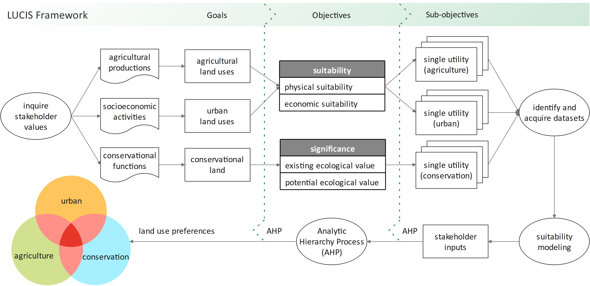

# Welcome to LUCISOPEN

LUCISOPEN is a GIS-based, open-source land use planning framework.
It is a new system developed by the Ghana Land Use Project ([GALUP](http://galup.cersgis.org/)) for the Land Use Spatial Planning Agency (LUSPA) of Ghana to replace the existing Land Use Planning and Management Information System (LUPMIS). LUPMISplus is based on the Land-Use Conflict Identification Strategy (LUCIS), a goal-oriented land use decision-making model developed by Professor Peggy Carr and Professor Paul Zwick at the University of Florida. The intention of the QGIS processing algorithms presented in this repository is to allow planners and analysts to create LUCIS models with QGIS. We also provide you documentations and tutorials to guide you through the process of land use modeling.

## GALUP Training Sessions

1. [Module 1 - Software and Data Preparation](https://github.com/chjch/lucis_qgis/blob/master/trainings/workshop_1.md)
2. [Module 2]
3. [Module 3]
4. [Module 4]

## What tools are available

1. Density of Point Features
2. Density of Line Features
3. Distance to Line Features
4. Distance to Point Features
5. Distance to Raster Cells
6. Erase
7. Inverse Distance Weighting
8. Generate Random AHP Weights
9. Reclassify
10. Rescale Values Linearly
11. Rescale Values by Probability
12. Select by Location
13. Spatial Join
14. Weighted Sum of Columns
15. Zonal Statistics

## [Installation](https://github.com/chjch/lucis_qgis/wiki/Installation)

## Resources

1. [University of Florida](https://abe.ufl.edu/galup/)

   &nbsp
   &nbsp
   &nbsp
  

