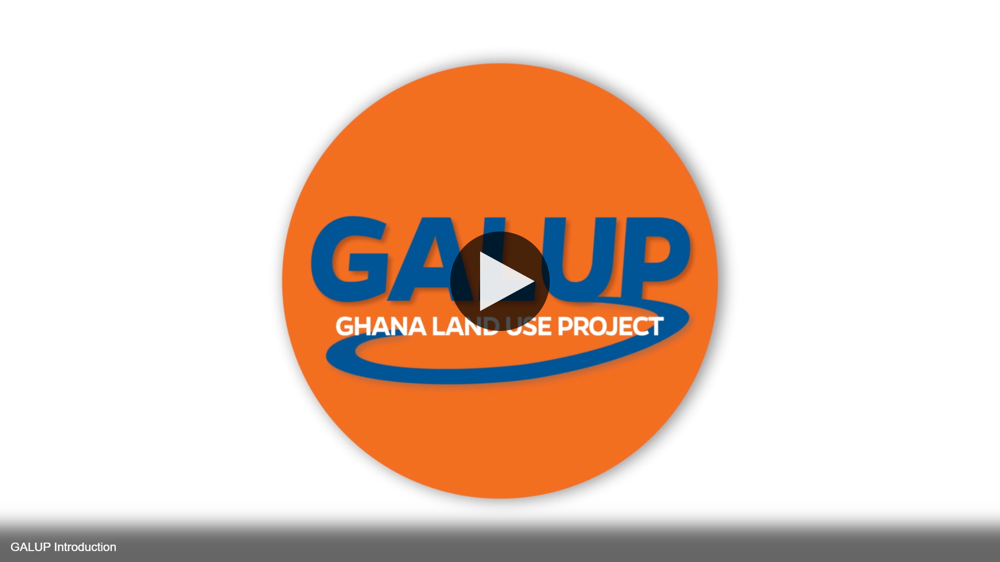
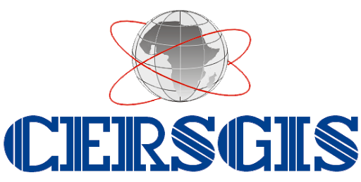

# Welcome to GALUP

## Introduction

In Ghana, farmlands and cities are expanding rapidly into the savannas,
woodlands and forests.
The Ghana Land Use Project ([GALUP](http://galup.cersgis.org/)) project will
enhance the current operational planning framework and building capacity for
effective land use planning in Ghana.
Working in close collaboration with national and regional authorities in
Ashanti, Eastern and Central Regions in Ghana, the project aims to build local
capacity in the region regarding remote sensing and GIS, and transfer the land
use planning framework for continued planning.

 

## GALUP Trainings

One of GALUP’s objectives is to help build local capacity in applying tools
empowered by Remote Sensing (RS) and Geographic Information System (GIS)
technologies to inform and ensure sustainable land use practices.

### [Workshop 1 - Land-Use Suitability Analysis with QGIS Tools](https://github.com/SERVIR-WA/GALUP/tree/master/training/1_lu/modules)

> **Instructor**: [Dr. Changjie Chen](https://github.com/chjch) (<ins>chj.chen@<i></i>ufl.edu</ins>).&nbsp;&nbsp;&nbsp;&nbsp;
> **Date**: June 1 - August 10, 2021. 
> **Co-authors**: Genglin Yang and Shenyu Lyu.

1. [Module 1 - Software and Data Preparation](https://github.com/SERVIR-WA/GALUP/blob/master/training/1_lu/modules/module1.md)
2. [Module 2 - Introduction to LUCIS-OPEN Tools for QGIS](https://github.com/SERVIR-WA/GALUP/blob/master/training/1_lu/modules/module2.md)
3. [Module 3 - Create Suitability Models with QGIS Graphical Modeler](https://github.com/SERVIR-WA/GALUP/blob/master/training/1_lu/modules/module3.md)
4. [Module 4 - Aggregate Results to Make Land-Use Decisions](training/1_lu/modules/module4.md)

### [Workshop 2 - Introduction to Satellite Remote Sensing](https://github.com/SERVIR-WA/GALUP/tree/master/training/2_rs)

> **Instructor**: [Dr. Aditya Singh](https://abe.ufl.edu/people/faculty/aditya-singh/) (<ins>aditya01@<i></i>ufl.edu</ins>).&nbsp;&nbsp;&nbsp;&nbsp;
> **Date**: November 8 - December 6, 2021. 
> **Co-authors**: Dr. Jasmeet Judge, Julie Peeling, and Luc Olivier.

1. [Module 1 - Introduction to Remote Sensing (RS)](training/2_rs/module1.md)
2. [Module 2 - RS Applications using Google Earth Engine](training/2_rs/module2.md)
3. [Module 3 - Common RS Indices and Environmental Variables](training/2_rs/module3.md)
4. [Module 4 - Land Cover Classification](training/2_rs/module4.md)

### [Workshop 3 - Integrated Decision Units for Land Use Suitability Modeling](https://github.com/SERVIR-WA/GALUP/tree/master/training/3_idu)

> **Instructor**: [Dr. Changjie Chen](https://github.com/chjch) (<ins>chj.chen@<i></i>ufl.edu</ins>).&nbsp;&nbsp;&nbsp;&nbsp;
> **Date**: April 4 - April 8, 2022. 
> **Co-authors**: Alex Eide.

## Documentation

1. [LUCIS-OPEN Tools for QGIS](https://github.com/SERVIR-WA/GALUP/wiki/Tools)
2. [Agriculture Models](https://github.com/SERVIR-WA/GALUP/wiki/models_ag)

## GALUP Partners

We appreciate all the support from our partners below. 

<table style="border: 0;">
  <tr> 
    <td vlign="center" style="border: 0;"></td>
    <td vlign="center" style="border: 0;"></td>
    <td vlign="center" style="border: 0;"></td>
    <td vlign="center" style="border: 0;"></td>
  </tr>
</table>
 
<table>
  <tr>    
    <td></td>
    <td></td>
    <td></td>
    <td></td>
  </tr>
</table>
