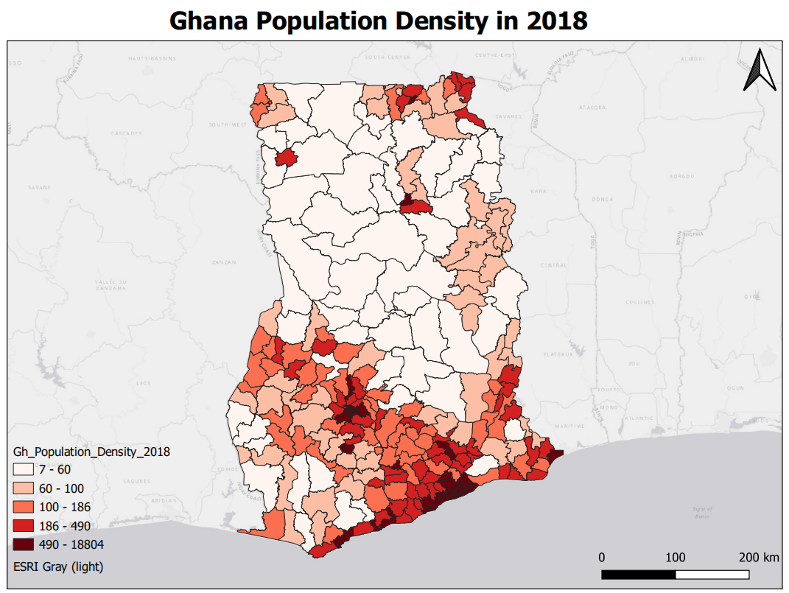

# Exercise 2

## 1. Description

In Exercise 1, we made a population map of Ghana (2018), and in Exercise 2, we want to know the population density distribution in Ghana (2018). Therefore, you are supposed to calculate the 2018 population density of Ghana by working with the [**Attribute Table**](https://docs.qgis.org/3.10/en/docs/user_manual/working_with_vector/attribute_table.html?highlight=attribute#introducing-the-attribute-table-interface) and [**Field Calculator**](https://docs.qgis.org/3.10/en/docs/training_manual/processing/vector_calculator.html?highlight=field%20calculator#vector-calculator) tool. Finally, you should export your population density map as a PDF file.

Download the dataset for this exercise [here](). 
For the video instruction of the **Field Calculator** click [here](https://www.youtube.com/watch?v=PkGON2G8vEU).

## 2. Skills Practiced

 By finishing this exercise, you will be able to:

- Get familiar with the **Attribute Table**.
- Use the **Field Calculator** tool.
- Create a layout and export the map.

## 3. Instruction
1. Add the data (_Gh_260_MMDA_WGS84_) to the _Layer_ panel.
2. Open the _Attribute Table_ of the data to review the field containing population data (_Pop\_2018_) and the field containing the area of each district data (_Area\_km2_).
3. Search and open the **Field Calculator** tool in the [**Processing Toolbox**](https://docs.qgis.org/3.10/en/docs/user_manual/processing/toolbox.html?highlight=processing%20toolbox#the-toolbox).
4. In the **Field Calculator** tool, create a new field and type the correct expression for calculating the population density by using _Pop\_2018_ and _Area\_km2_.
5. Use the _Graduated_ symbology and _Reds_ color ramp with 5 classes to render the population density distribution.
6. Add _ESRI Gary (light)_ as your basemap.
7. Create a _Layout_ and add a _Label_, a _Legend_, a _Scale bar_, and a _North Arrow_.
8. Export your map as a PDF file.
  
## 4. Output
