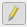

# Module 1 - Exercise 2

## 1. Description

In Exercise 1, we made a map of the population of Ghana in year 2018. In this
exercise, we will calculate _Population Density_ for individual Districts by,
first, reviewing the data in
[**Attribute Table**](https://docs.qgis.org/3.10/en/docs/user_manual/working_with_vector/attribute_table.html?highlight=attribute#introducing-the-attribute-table-interface),
and then calculating density (population/area) in the
[**Field Calculator**](https://docs.qgis.org/3.10/en/docs/user_manual/working_with_vector/attribute_table.html#using-the-field-calculator).
Finally, we will export the population density map as a PDF file.

## 2. Dataset

We will, again, use the _shapefile_ named **_Gh\_260\_MMDA.shp_** at
`GALUP-master -> training -> 1_lu -> datasets -> District of Ghana`
to do this exercise.

Check out this tutorial [here](https://www.youtube.com/watch?v=PkGON2G8vEU)
for the details about how to use **Field Calculator**.

## 3. Skills Practiced

This exercise covers:

- Get familiar with QGIS **Attribute Table**.
- Learn how to use the **Field Calculator** tool.
- Calculate population density based on the population and the area of a given
  territory.

## 4. Instruction

1. Add the data (_Gh\_260\_MMDA.shp_) to Map Canvas.
2. Open the _Attribute Table_ of the data to view two fields: _Pop\_2018_
   (population by district in 2018) and _Area\_km2_ (area by district in square
   kilometers).
3. Open **Field Calculator** from the menu bar on the top of the Attribute
   Table .
4. In the **Field Calculator**,
   - **Create a new field** with name "Pop_Den", and
   - specify the **Expression** to calculate population density using two
     fields: _Pop\_2018_ and _Area\_km2_.
5. Save your results on the attribute table by clicking _Toggle editing mode_  on the menu bar of the attribute table, or press _Ctrl\+E_.
6. Choose the _Graduated_ symbology and the _BuPu_ color ramp with 5 classes to
   render _Pop\_Den_, the newly calculated field.
7. Add _ESRI Gary (light)_ as a basemap.
8. Create a _Layout_ and add a _Label_, a _Legend_, a _Scale bar_, and
   a _North Arrow_.
9. Export your map as a PDF file.
  
## 5. Result

- Upon completion, the map you got should look similar to this pdf
  [here](../pdf_maps/DensityMap2.pdf).
- Now you have completed both exercises. Please go back to
  [Module 1](https://github.com/SERVIR-WA/GALUP/blob/master/training/1_lu/modules/module1.md#4-exercises) to turn in them.
