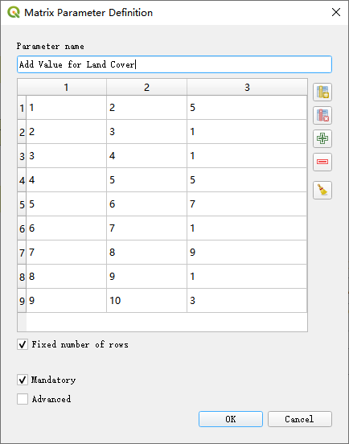

# Module 3 - Exercise 1

## 1. Skills Practiced

This exercise will practice:

- **QGIS Graphical Modeler**
- **Land Condition Model**

The Land Condition model will use following tools:

1. [Reclassify Field](https://github.com/SERVIR-WA/GALUP/wiki/Tools#reclassify-field)
2. [Reclassify by table](https://docs.qgis.org/3.4/en/docs/user_manual/processing_algs/qgis/rasteranalysis.html#reclassify-by-table)
3. [Weight Sum of Fields](https://github.com/SERVIR-WA/GALUP/wiki/Tools#weighted-sum-of-fields)
4. [Zonal Statistics](https://github.com/SERVIR-WA/GALUP/wiki/Tools#zonal-statistics)

## 2. Description

_Land Condition_ is a sub-objective of the physical objective.

_Land Condition_ model aims to evaluate the capacity of land to respond to
rain and produce useful pasture by measuring the slope percent and land cover
condition.
In term of land cover, we wish to select out the suitable land while protect
existing forest.
We list following table to indicate which land cover is more suitable to grow
row crops.
|      |  Land Cover Types                     | Suitability  |
|------|---------------------------------------|--------------|        
|  1   |  Open forest, unknown                 |      5       |
|  2   |  Closed forest, unknown               |      1       |
|  3   |  Closed forest, evergreen broad leaf  |      1       |
|  4   |  Open forest, evergreen broad leaf    |      5       |
|  5   |  Shrubs                               |      7       |
|  6   |  Urban / built up                     |      1       |
|  7   |  Herbaceous vegetation                |      9       |
|  8   |  Closed forest, deciduous broad leaf  |      1       |
|  9   |  Herbaceous wetland                   |      3       |

note: lands with higher suitability score are more suitable to grow
row crops. 

According to research[1](), slope percent could be attributed into 5
classes in following range:

| Slope (percent rise) | Suitability |
|----------------------|-------------|
| 0-2                  | 9           |
| 2-8                  | 7           |
| 8-15                 | 5           |
| 15-25                | 3           |
| 25-45                | 1           |

note: lands with higher suitability score are more suitable to grow
row crops. 

## 3. GIS Dataset

You should use the following data to finish this exercise:
- _THLD\_poly.shp_ at
`GALUP-master -> training -> 1_lu -> datasets -> IDUs in the THLD District`
- _Slope\_Percent.tif_ at
`GALUP-master -> training -> 1_lu -> datasets -> Slope_Percent`
- _iSDA\_MGRS.tif_ at
`GALUP-master -> training -> 1_lu -> datasets -> Ghana Land Cover 2019`

In THLD district, different land cover types are represented by numbers in
Dataset. The table below lists all land cover types collected in 2019:

| Value|  Land Cover Types                     |
|------|---------------------------------------|
|  1   |  Open forest, unknown                 |
|  2   |  Closed forest, unknown               |
|  3   |  Closed forest, evergreen broad leaf  |
|  4   |  Open forest, evergreen broad leaf    |
|  5   |  Shrubs                               |
|  6   |  Urban / built up                     |
|  7   |  Herbaceous vegetation                |
|  8   |  Closed forest, deciduous broad leaf  |
|  9   |  Herbaceous wetland                   |

## 4. Instruction

|          Model         |
|------------------------------------------|
|  |

1. Click
   in **_Processing Toolbox_** and choose `Create New Model...`.
2. Click **_Model Properties_** and type _Land Condition_ in **Name** and
   _Physical_ in **Group**.
3. Add _Vector Layer_, name it **1Input layer**, and choose _Polygon_ in  **Geometry type**.
4. Add Raster Layer and name it **2Land Cover**.
5. Add _Matrix_, name it **3Add Value for Land Cover**, and then set table as
   following:

|          Matrix setting         |
|------------------------------------------|
|  |
6. Remove all prefix **1**, **2**, **3** in name.
   > :bulb: **A tip for remove name prefix** 
   > Because of Q GIS work omission in this vesion, we need to order the adding
   > element by ourselves. We can give each element with sequence number when
   > we add it to the model.

   |          Parameter setting         |
   |------------------------------------------|
   |  |
7. Click **_Algorithms_**, Add the
   **<ins>Reclassify by table</ins>** tool under **_Raster analysis_**,
   and rename it **Add Value for Land Cover**, then set
   parameters as it shows in table (click advanced parameters).
9. Add the
   **<ins>Zonal Statistics</ins>** tool under **_Scripts_**
   ,
   and rename it **Add LC to Polygon**, then set parameters.
11. Add _Raster Layer_ and name it **4Slope**.
12. Add two _String_, name one as **5Parameters for LCC**, and then set
    **Default value** as: 0-2,2-8,8-15,15-25,25-45; and name another one as
    **6LCC Classes**, and then set **Default value** as: 9,7,5,3,1.
13. Remove all prefix **4**, **5**, **6** in name.
14. Add the
   **<ins>Zonal Statistics</ins>** tool under **_Scripts_**
   ,
   and rename it **Add Slope to Polygon**, then setparameters.
16. Add the **<ins>Reclassify Field</ins>** tool
    under **_Scripts_**
    ,
    and rename it **Rec Slope Percent**, then set parameters.
18. Add _String_, name it as **7Weight by LC Slope**, and then set **Default value**
   as: 0.5,0.5 (these values suggest land cover and slope are equally important
   in determining the _Land Condition_ sub-objective).
19. Remove prefix **7** in name.
20. Add the
   **<ins>Weighted Sum of Fields</ins>** tool under **_Scripts_**
   ,
   and rename it **Weighted Sum LC & Slp**, then set parameters.
22. Save the model in a folder you can find.
23. Locate _Slope\_Percent.tif_, _iSDA\_MGRS.tif_, and _THLD\_poly.shp_ in the **_Browser Panel_** and add them to **_Map Canvas_**.
24. In the **_Processing Toolbox_** panel, locate the
   **<ins>Land Condition</ins>** model under **_Models_** -> **_Physical_**.
25. **Double Click** to open the model and set parameters as follows:
    <ol type="a">
       <li><b>Input layer</b>: THLD_poly,</li>
       <li><b>Land Cover</b>: iSDA_MGRS,</li>
       <li><b>Slope</b>: Slope_Percent,</li>
       <li>leave all other parameters as default.</li>
    </ol>
26. Click **Run**.
27. Now let's setup the **Symbology** of the output layer.
    Open the
    
    Symbology tab from the **_Layer Properties_** window.
    Select the 
    Graduated style.
    Specify the _LandCondit_ field as **Value**, then choose the _Reds_ color
    ramp with 5 classes. Click **Apply**.
28. Click **OK** on the **Symbology** tab.
29. Create a _Layout_, then add _Legend_, _Scale bar_, and _North Arrow_ to the
    layout.
30. Export the map as a PDF file.

## 5.Result

- Upon completion, the map you got should look similar to this pdf
  [here](https://github.com/SERVIR-WA/GALUP/blob/master/training/1_lu/pdf_maps/LandConditionMap.pdf).
- Now you have completed all exercises. Please go back to
  [Module 3](https://github.com/SERVIR-WA/GALUP/blob/master/training/1_lu/modules/module3.md)
  to turn in them.

## 6.Reference

1. Scopesi, C., Olivari, S., Firpo, M., Scarpellini, P., Pini, S., & Rellini, I. (2020). Land capability classification of Vernazza catchment, Cinque Terre National Park, Italy. Journal of Maps, 16(2), 357-362.
