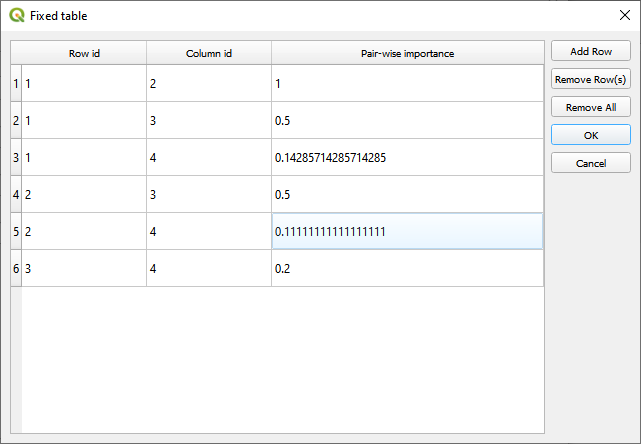
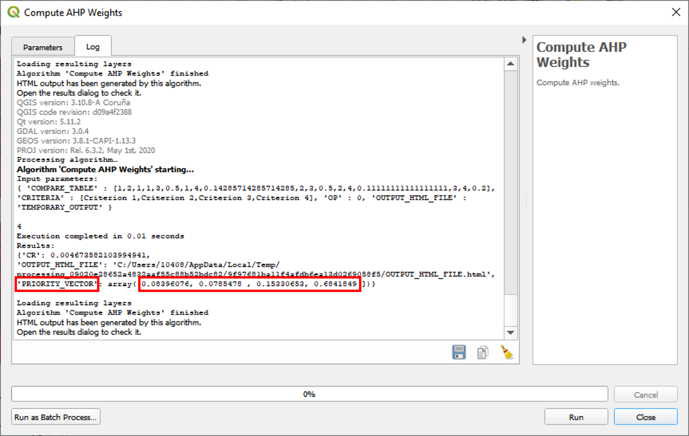

# Module 4 - Exercise 2

## 1. Skills Practiced

This exercise will practice:

- **Analytic Hierarchy Process (AHP)**

## 2. Description

As a modeler, you are trying to make land-use decisions for THLD by using LUCIS.
Now you have four agricultural land-use purposes (goals): **Row crops**,
**Livestock**, **Timberland**, and **Orchards and groves**.
After finishing building up the suitability modeling for each land-use purpose,
you are ready to assign weights to these four purposes by using AHP.
Because these are agricultural land-use purposes, you asked four farmers about
interests and find:

- The first farmer mainly plants row crops.
- The second farmer focuses on livestock.
- The third farmer owns a sawmill.
- The fourth farmer is a owner of orchards.

Four farmers assign land-use suitability weights to each purposes as follows:

Note that their opinions are equally weighted (i.e., 0.25 for each type of
farmer).

Use the [**_Compute AHP Weights_**](https://github.com/SERVIR-WA/GALUP/wiki/Tools#compute-ahp-weights) tool in LUCIS-OPEN to compute the weights
for the four land-use purposes.

## 3. Instruction

1. Open the **_Compute AHP Weights_** tool in QGIS.
2. Select **Define AHP weights** for _Weights generating options_.
3. For the _List of criteria to weight_, click the "..." button and double
   click to change the default name "Criteria 1", "Criteria 2", and
   "Criteria 3" to `Row crops`, `Livestock`, and `Timberland` respectively.
4. Click **Add Row** button to add a new row and name it as
   `Orchards and groves`. Then, click **OK**.
5. For the _Comparison table for creating the reciprocal matrix_, click the
   "..." button and add three new rows by click **Add Row** button. You need to
   fill out the values in each form in this table.
6. Take the form of **Farmer 4** as an example, set the parameters in the
   table as follows:
    
   Note that _Row id_ and _Column id_ denote the row index and column index
   respectively.
   For instance, _Row id_ 2 and _Column id_ 3 represents the cell in second row
   and third column in the form of **Farmer 4**. the _Pair-wise importance_
   stores the value in that cell, which is 1/2 (0.5).
7. Click **OK** to close the window, and click **Run**.
8. The weights for the four land-use purposes are shown as values in the line
   _PRIORITY_VECTOR_.
   
9. Repeat the process above to calculate the weights for the forms of
   **Farmer 1**, **Farmer 2**, and **Farmer 3**.

## 5.Result

- Upon completion, your result should look similar to the following table:
  .
- Please go back to [Module 4](https://tinyurl.com/yn9hy6ca) to complete the
  third exercise.
