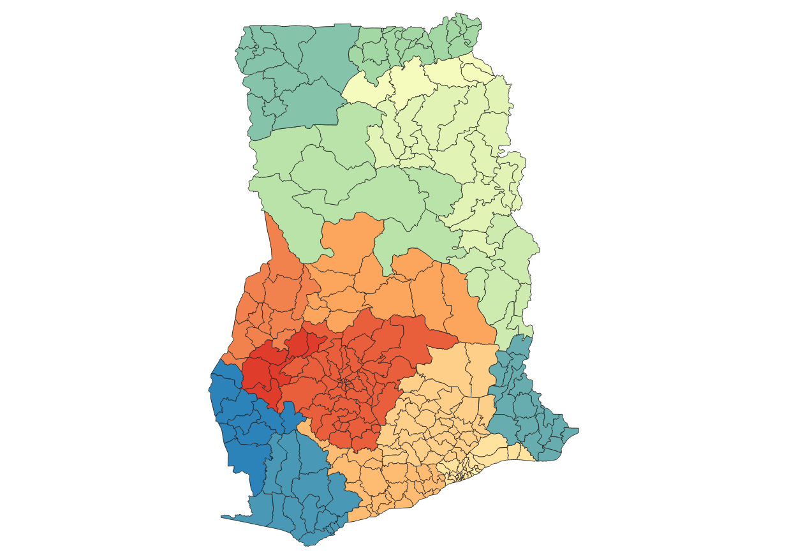
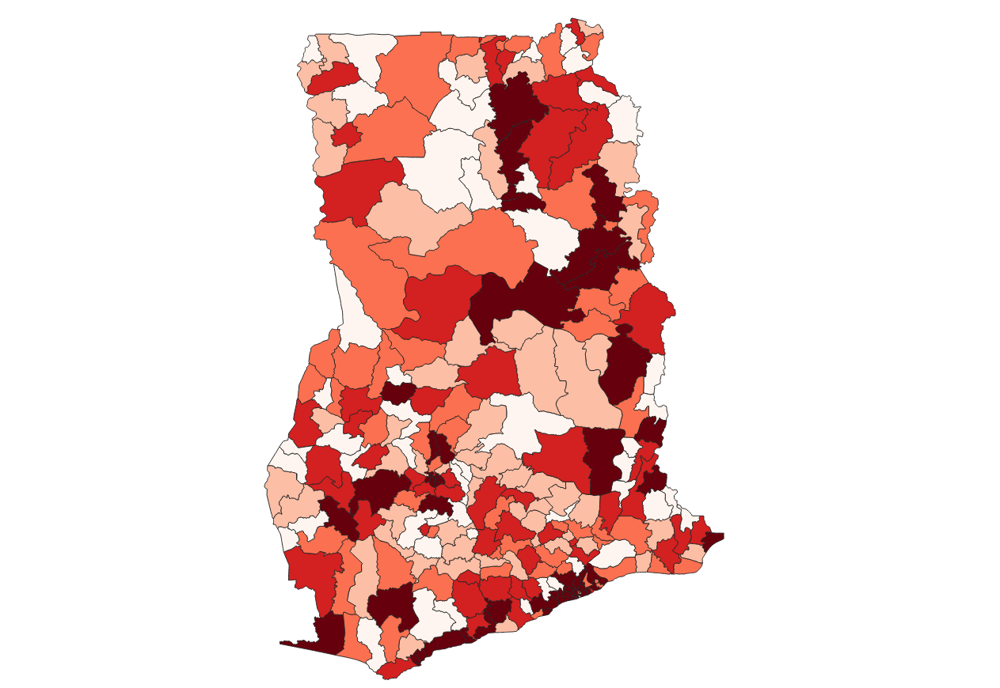
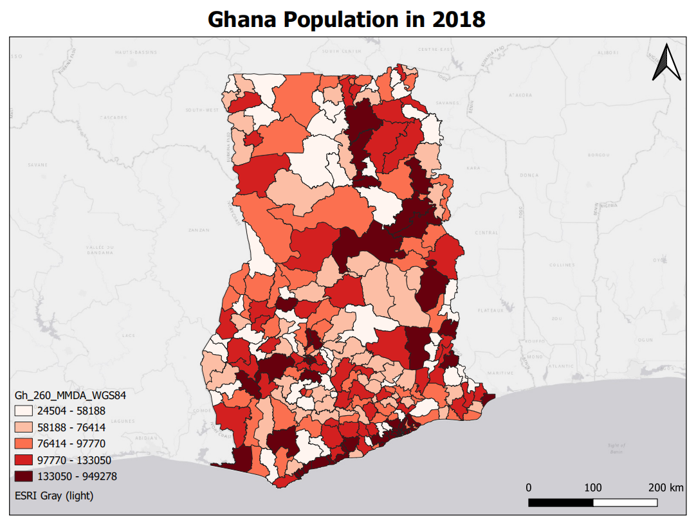

# Module 1 - Software and Data Preparation

**What will you learn from this module?**

- Installing QGIS and PyLUSAT (Python for Land Use Suitability Analysis Tools),
- Introducing the interface of QGIS 3.10.8,
- Visualizing the datasets prepared for this series of trainings in QGIS.

---

## 1. Software Installation

> :pushpin: 
> Follow the [instruction](https://github.com/SERVIR-WA/GALUP/wiki/Install)
> to install [QGIS 3.10.8](https://qgis.org/en/site/) and
> [PyLUSAT v0.4.0](https://pypi.org/project/pylusat/) package, which
> must be installed before we can successfully load and run the tools GALUP
> have developed.

## 2. Using QGIS to Create Maps

We will explore the QGIS user interface so that you are familiar with the
menus, toolbars, map canvas and layers list that form the basic structure of
the interface.

### 2.1 The QGIS User Interface

[Elements](https://docs.qgis.org/3.10/en/docs/training_manual/basic_map/overview.html)
of the QGIS GUI (Graphic User Interface).

- Layers List / Browser Panel
- Toolbars
- Map canvas
- Status bar
- Side Toolbar
- Locator bar

You can also customize the QGIS GUI to fits your own preferences and needs.

### 2.2 Add Data to _map canvas_
[Browser panel](https://docs.qgis.org/3.10/en/docs/user_manual/introduction/browser.html?highlight=favoriate#the-browser-panel) in QGIS can let you easily navigate in your filesystem and manage geodata.
- Drag and drop the target files from brower panel into the map canvas
- Explore the [Interface](https://docs.qgis.org/3.10/en/docs/user_manual/managing_data_source/opening_data.html?highlight=browser%20panel#exploring-the-interface) and interact with the [Browser items](https://docs.qgis.org/3.10/en/docs/user_manual/managing_data_source/opening_data.html?highlight=browser%20panel#interacting-with-the-browser-items)
- Add the data you frequently used to [Favorites](https://docs.qgis.org/3.10/en/docs/training_manual/basic_map/overview.html?highlight=favoriate#basic-the-browser-panel)

### 2.3 Open the _Attribute Table_ to Review Your Data

The [attribute table](https://docs.qgis.org/3.10/en/docs/user_manual/working_with_vector/attribute_table.html?highlight=attribute#introducing-the-attribute-table-interface) displays information on features of a selected layer.

- Put the cursor on a layer of your interest, and right click the layer and
  click _Open Attribute Table_.
- The title of the Attribute Table window includes the name of the layer, the
  total number of the features in the layer, the number of features are
  filtered, and the number of features are selected. You can find the
  attributes of all features in the layer.

### 2.4 Symbology
The symbology of a layer is one of important functions in GIS. By presenting the data with a dynamic visual appearance on the map, you can better explore the data as you are working with it.
- Symbolize the vector layers using the [Symbology](https://docs.qgis.org/3.10/en/docs/training_manual/basic_map/symbology.html?highlight=symbology#basic-fa-changing-colors) tab in the layer properties
- Choose the [Categorized](https://docs.qgis.org/3.10/en/docs/user_manual/working_with_vector/vector_properties.html?highlight=single%20color#categorized-renderer) option to present the data, if you have data that is broken into categories (i.e. male or female, hair color, political party, etc.)
- Choose the [Graduated](https://docs.qgis.org/3.10/en/docs/user_manual/working_with_vector/vector_properties.html?highlight=single%20color#graduated-renderer) option to present the data, if you have numeric data you want to symbolize (i.e. total population)

|                   Categorized color                    |               Graduated color                  |
|:--------------------------------------------------------:|:---------------------------------:|
|   |   |

### 2.5 Add a _Basemap_ to Map Canvas

A [basemap](https://rdkb.sgrc.selkirk.ca/Help/Content/Client_APIs/SV_User/SVU_AboutBaseMaps.htm) is a layer with geographic information that serves as a background. A base map provides context for additional layers that are overlaid on top of the base map.

- To add a basemap to the map canvas, in QGIS, we need to install an
  [QGIS plugin](https://docs.qgis.org/3.10/en/docs/user_manual/plugins/plugins.html).
- Open the **Plugin** Window, search and install [**QuickMapServices**](https://docs.qgis.org/3.10/en/docs/training_manual/qgis_plugins/plugin_examples.html#basic-fa-the-quickmapservices-plugin).
- After installation, open the **QuickMapServices Settings** window, click the _More Services_ tab, and click _Get contributed pack_ to get more basemaps.
- Add one basemap from **QuickMapServices** to map canvas.

|                Layer with a Basemap                  |
|:-------------------------------------------------:|
|  |

### 2.6 Create a _Layout_ to Print Your Map

After setting up the map, you are now ready to [layout](https://docs.qgis.org/3.10/en/docs/user_manual/print_composer/overview_composer.html#overview-of-the-print-layout) your map and print it (as a pdf file) to share with your colleagues.
  
- Open the [**Layout Manager**](https://docs.qgis.org/3.10/en/docs/user_manual/print_composer/overview_composer.html#the-layout-manager) window, click the _Create..._ button, and name your
  map and click _OK_ to open the map window.
- In the map window, click the [_Add Item_ button](https://docs.qgis.org/3.10/en/docs/user_manual/print_composer/overview_composer.html#add-item-menu) on the main menu bar, and
  click add map.
- In order to have a decent map, you might need a **Name** for your map, a **Legend** to identify the elements in the map, a **Scale Bar**
  to indicates the scale of the map, a **North Arrow** to
  indicate the direction. You can add these items under the _Add Item_ button.
- After you finishing all the layout of your map, click the _Layout_ button on
  the main menu bar, and click [_Export as PDF..._](https://docs.qgis.org/3.10/en/docs/user_manual/print_composer/overview_composer.html#edit-menu) to export your map. (If the basemap can't be rendered in the PDF, try a lower _dpi_ in the **Export Setting** in the **Layout** tab.)

|               Example of the Printed Layout           |
|:-------------------------------------------------:|
|  |

## 3. Get to Know the Datasets

- [Download](https://github.com/chjch/lucis_qgis) the datasets from GitHub
- Identify and acquire useful datasets

| Theme | ID | File Name            | Data Format | Type | Description                                               |
|-------|----|----------------------|-------------|------|-----------------------------------------------------------|
| Demography | 1   2   3 | Gh_260_MMDA_WGS84   population_gha_2018-10-01   pop_landsat_2018_THLD | vector   raster   raster  | polygon   tiff   tiff    | Areas and Population of Ghana 2018   Ghana Population 2018   Twifo/Heman/Lower Denkyira District Population |
| Regions & Boundary | 4   5   6 | THLD_Boundary   THLD_poly   Gh_260_MMDA | vector   vector   vector | polygon   polygon   polygon | Twifo/Heman/Lower Denkyira District Boundary   Twifo/Heman/Lower Denkyira District Administrative Region   Administration Regions of Ghana |
| Urban Facilities | 7   8   9   10 | built_area_cluster   Education_Facilities   Health_Facilities   osm2020_allrds_THLD | vector   vector   vector   vector | point   point   point   line | built_area_points   Education_Facilities   Health_Facilities   Road Network |
| Soils & Land Condition  | 11   12   13   14   15   16   17   18   19   20 | Twifo_Hemang_Lower_Denkyira1   Drain_THLD100   RZD_THLD100   Slope_Percent   SD0_5   SD5_15   SD15_30   SD30_60   SD60_100   SD100_200 | raster   raster   raster   raster   raster   raster   raster   raster   raster   raster | tiff   tiff   tiff   tiff   tiff   tiff   tiff   tiff   tiff   tiff | Twifo/Heman/Lower Denkyira District Elevation   [Soil Drainage](https://data.isric.org/geonetwork/srv/eng/catalog.search#/metadata/953d0964-6746-489a-a8d1-f188595516a9)   [Root Zone Depth](https://data.isric.org/geonetwork/srv/eng/catalog.search#/metadata/c77d1209-56e9-4cac-b76e-bbf6c7e3a617)   Slope Percent   [Soil PH 0-5](https://data.isric.org/geonetwork/srv/eng/catalog.search#/metadata/a3364e47-9229-4a6d-aed2-487fd7e4dccc)   [Soil PH 5-15](https://data.isric.org/geonetwork/srv/eng/catalog.search#/metadata/a3364e47-9229-4a6d-aed2-487fd7e4dccc)   [Soil PH 15-30](https://data.isric.org/geonetwork/srv/eng/catalog.search#/metadata/a3364e47-9229-4a6d-aed2-487fd7e4dccc)   [Soil PH 30-60](https://data.isric.org/geonetwork/srv/eng/catalog.search#/metadata/a3364e47-9229-4a6d-aed2-487fd7e4dccc)   [Soil PH 60-100](https://data.isric.org/geonetwork/srv/eng/catalog.search#/metadata/a3364e47-9229-4a6d-aed2-487fd7e4dccc)   [Soil PH 100-200](https://data.isric.org/geonetwork/srv/eng/catalog.search#/metadata/a3364e47-9229-4a6d-aed2-487fd7e4dccc) |
| Forest & Water | 21   22   23   24   25 | Forest_Reserve   Hydro   Hansen_GFC-2019-v1.7_gain_10N_010W   Hansen_GFC-2019-v1.7_lossyear_10N_010W   Hansen_GFC-2019-v1.7_treecover2000_10N_010W | vector   vector   raster   raster   raster | polygon   line   tiff   tiff   tiff | Forest_Reserve   Hydro   [Global Rorest Cover Gain 2000–2012](https://earthenginepartners.appspot.com/science-2013-global-forest/download_v1.7.html)   [Year of Gross Forest Cover Loss Event](https://earthenginepartners.appspot.com/science-2013-global-forest/download_v1.7.html)   [Tree Canopy Cover for Year 2000](https://earthenginepartners.appspot.com/science-2013-global-forest/download_v1.7.html) |
| Land Cover | 26   27   28   29 | iSDA_MGRS   GhanaClassMODIS_2019   GhanaClassMODIS_2010   GhanaClassMODIS_2001 | raster   raster   raster   raster | tiff   tiff   tiff   tiff | Land Cover Type Ghana 2019   Land Cover Type 2019   Land Cover Type 2010   Land Cover Type 2001 |

## 4. Exercises

- Please complete the exercise [here](https://github.com/chjch/lucis_qgis).

## 5. Additional Resources

- [What is GIS and why use QGIS](https://www.youtube.com/watch?v=8oEnJvLzDnQ)
- [QGIS User Guide](https://docs.qgis.org/3.16/en/docs/user_manual/)

## 6. Post-training Survey

Upon completion, please take this [survey](https://docs.google.com/document/d/1p1oy635ZMgXBcyxPJPv2Je-62xTVaNV6xCtltQYvde0/edit) to summarize what you have
learned and also help us improve this tutorial.

## 7. What's Next?

Module 2 - Introduction to LUCISOPEN Tools