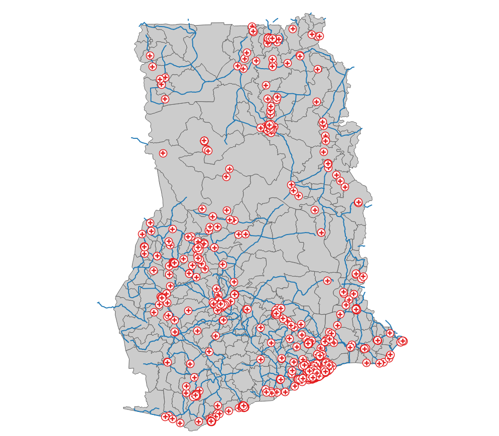
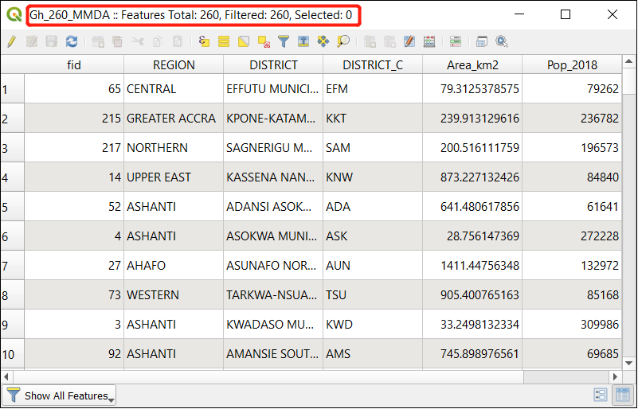
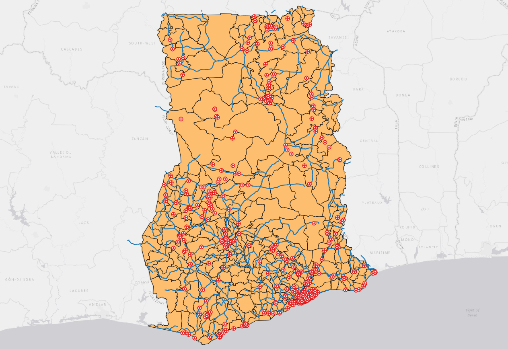

# Module 1 - Software and Data Preparation

**What will you learn from this module?**

- Installing QGIS and PyLUSAT,
- Loading _LUCIS-OPEN Tools for QGIS_,
- Be familiar with the interface of QGIS 3.10.8,
- Visualizing the datasets prepared for this workshop in QGIS,
- Creating Layouts to print maps.

## 1. Software Installation

> :pushpin: 
> Follow the [instruction](https://github.com/SERVIR-WA/GALUP/wiki/Install)
> to install [QGIS 3.10.8](https://qgis.org/en/site/) and
> [PyLUSAT v0.4.0](https://pypi.org/project/pylusat/) package, which
> must be installed before we can successfully load and run the tools GALUP
> have developed.

## 2. Working with QGIS 3.10.8

We will explore the QGIS user interface so that you are familiar with the
menus, toolbars, map canvas and layers list that form the basic structure of
the interface.

### 2.1 The QGIS Graphical User Interface (GUI)

[Elements](https://docs.qgis.org/3.10/en/docs/user_manual/introduction/qgis_gui.html)
of the QGIS GUI (Graphic User Interface).

- Layers List / Browser Panel
- Toolbars
- Map canvas
- Status bar
- Side Toolbar
- Locator bar

You can also customize the QGIS GUI to fits your own preferences and needs.

### 2.2 Add Data to [_Map Canvas_](https://docs.qgis.org/3.10/en/docs/training_manual/basic_map/mapviewnavigation.html)

1. The primary way to add data to QGIS Map Canvas is by **drag-and-drop** Brower items
from [Browser panel](https://docs.qgis.org/3.10/en/docs/user_manual/introduction/browser.html?#the-browser-panel).
2. The another way to add data is by [**loading layer from a file**](https://docs.qgis.org/3.10/en/docs/user_manual/managing_data_source/opening_data.html?#loading-a-layer-from-a-file).
> :pushpin: 
> In the Browser Panel, you can also add the folder you frequently used to [Favorites](https://docs.qgis.org/3.10/en/docs/training_manual/basic_map/overview.html?highlight=Favorites#basic-the-browser-panel). You can also `Rename Favorite...`.

  Now, lets load _Administration Regions of Ghana_, _Roads Network_, and _Health Facility_ to Map Canvas:

|               Roads Network in Ghana              |
|:-------------------------------------------------:|
|  |

### 2.3 Open the _Attribute Table_ to Review Your Data

The [Attribute Table](https://docs.qgis.org/3.10/en/docs/user_manual/working_with_vector/attribute_table.html?highlight=attribute#introducing-the-attribute-table-interface) displays
information on features of a selected layer.

- Right click the layer of your interest, and
  click `Open Attribute Table`.
- The title of the Attribute Table window includes: 1) the title of the layer, 2) the
  total number of the features in the layer, 3) the number of features are
  filtered, and 4) the number of features are selected.

|               Attribute Table           |
|:-------------------------------------------------:|
|  |

### 2.4 Symbology

The symbology of a layer is one of important functions in GIS. By presenting the data with a dynamic visual appearance on the map, you can better explore the data as you are working with it.
- Symbolize the vector layers using the [Single Symbology](https://docs.qgis.org/3.10/en/docs/training_manual/basic_map/symbology.html?#basic-fa-changing-colors) in the layer
properties.
- Choose the [Categorized](https://docs.qgis.org/3.10/en/docs/user_manual/working_with_vector/vector_properties.html?#categorized-renderer) option to present the data, if you have data that is broken into categories (the image in the middle is using region column).
- Choose the [Graduated](https://docs.qgis.org/3.10/en/docs/user_manual/working_with_vector/vector_properties.html?#graduated-renderer) option to present the data, if you have numeric data you want to symbolize (the image on the right is using the population column).

|            Single Symbology                              |                   Categorized Symbology                    |               Graduated Symbology                  |
|:--------------------------------------------------------:|:--------------------------------------------------------:|:---------------------------------:|
|      |   |   |

### 2.5 Add a _Basemap_ to Map Canvas
A [Basemap](https://rdkb.sgrc.selkirk.ca/Help/Content/Client_APIs/SV_User/SVU_AboutBaseMaps.htm) is a layer with geographic information that serves as a background. A base map provides context for additional layers that are overlaid on top of the base map. In this module, we use [**QuickMapServices**](https://docs.qgis.org/3.10/en/docs/training_manual/qgis_plugins/plugin_examples.html#basic-fa-the-quickmapservices-plugin), a QGIS [Plugin](https://docs.qgis.org/3.10/en/docs/user_manual/plugins/plugins.html), to add basemap to Map Canvas.

1. Open the [**Plugins**](https://docs.qgis.org/3.10/en/docs/training_manual/qgis_plugins/fetching_plugins.html?#basic-fa-managing-plugins) window at the _main menu toolbar_, and click `Manage and Install Plugins...`
2. Search and [install a new Plugin](https://docs.qgis.org/3.10/en/docs/training_manual/qgis_plugins/fetching_plugins.html?#basic-fa-installing-new-plugins) called **QuickMapServices**.
3. After installation, open the **QuickMapServices Settings** window, click the _More Services_ tab, and click _Get contributed pack_ to get more basemaps. For details, please check out this [tutorial](https://opengislab.com/blog/2018/4/15/add-basemaps-in-qgis-30).
4. Choose one basemap from the **QuickMapServices** and add it to Map Canvas.
   

|                Layer with a Basemap                  |
|:-------------------------------------------------:|
|  |

### 2.6 Create a _Layout_ to Print Your Map

After setting up the map, you are now ready to [layout](https://docs.qgis.org/3.10/en/docs/training_manual/map_composer/map_composer.html#ls-using-print-layout) your map and print it (as a pdf file) to share with your colleagues.
  
- Open the [**Layout Manager**](https://docs.qgis.org/3.10/en/docs/training_manual/map_composer/map_composer.html#basic-fa-the-layout-manager) window, click the _Create..._ button, and name your
  map and click _OK_ to open the map window.
- In the map window, click the [`Add Item`](https://docs.qgis.org/3.10/en/docs/user_manual/print_composer/overview_composer.html#add-item-menu) button on the main menu bar, and
  click add map.
- In order to have a decent map, you need: 1) a [**Title**](https://docs.qgis.org/3.10/en/docs/training_manual/map_composer/map_composer.html#basic-fa-adding-a-title) for your map, 2) a [**Legend**](https://docs.qgis.org/3.10/en/docs/training_manual/map_composer/map_composer.html#basic-fa-adding-a-legend) to identify the elements in the map, 3) a [**Scale Bar**](https://docs.qgis.org/3.10/en/docs/user_manual/print_composer/composer_items/composer_scale_bar.html?#the-scale-bar-item)
  to indicates the scale of the map, 4) a [**North Arrow**](https://docs.qgis.org/3.10/en/docs/user_manual/print_composer/composer_items/composer_image.html?#the-picture-and-the-north-arrow-items) to
  indicate the direction. You can add these items under the `Add Item` button.
- After you finishing all the layout of your map, click the `Layout` button on
  the main menu bar, and click [`Export as PDF...`](https://docs.qgis.org/3.10/en/docs/user_manual/print_composer/create_output.html#export-layout-pdf) to export your map. (If the basemap cannot be rendered in the PDF file, try a lower _dpi_ (e.g., 150 dpi) in the [**Export Setting**](https://docs.qgis.org/3.10/en/docs/user_manual/print_composer/overview_composer.html#export-settings ) in the [**Layout Panel**](https://docs.qgis.org/3.10/en/docs/user_manual/print_composer/overview_composer.html#the-layout-panel).)
- See the example map PDF file [here](../pdf_download/MyMap.pdf).

## 3. Get to Know the Datasets

- [Download](https://github.com/chjch/lucis_qgis) the datasets from GitHub
- Identify and acquire useful datasets

| ID | File Name                 | Data Format | Type    | Description                                               |
|----|---------------------------|-------------|---------|-----------------------------------------------------------|
| 1  | Gh_260_MMDA_WGS84         | vector      | polygon | Areas and Population of Ghana 2018                        |
| 2  | population_gha_2018-10-01 | raster      | tiff    | Ghana Population 2018                                     |
| 3  | pop_landsat_2018_THLD     | raster      | tiff    | Twifo/Heman/Lower Denkyira District Population            |
| 4  | THLD_Boundary             | vector      | polygon | Twifo/Heman/Lower Denkyira District Boundary              |
| 5  | THLD_poly                 | vector      | polygon | Twifo/Heman/Lower Denkyira District Administrative Region |
| 6  | Gh_260_MMDA               | vector      | polygon | Administration Regions of Ghana                           |
| 7  | osm2020_allrds_THLD       | vector      | line    | Road Network                                              |
| 8  | Drain_THLD100             | raster      | tiff    | [Soil Drainage](https://data.isric.org/geonetwork/srv/eng/catalog.search#/metadata/953d0964-6746-489a-a8d1-f188595516a9)                                             |
| 9  | RZD_THLD100               | raster      | tiff    | [Root Zone Depth](https://data.isric.org/geonetwork/srv/eng/catalog.search#/metadata/c77d1209-56e9-4cac-b76e-bbf6c7e3a617)                                           |
| 10 | Slope_Percent             | raster      | tiff    | Slope Percent                                             |
| 11 | SD0_5                     | raster      | tiff    | [Soil PH 0-5](https://data.isric.org/geonetwork/srv/eng/catalog.search#/metadata/a3364e47-9229-4a6d-aed2-487fd7e4dccc)                                               |
| 12 | SD5_15                    | raster      | tiff    | [Soil PH 5-15](https://data.isric.org/geonetwork/srv/eng/catalog.search#/metadata/a3364e47-9229-4a6d-aed2-487fd7e4dccc)                                              |
| 13 | SD15_30                   | raster      | tiff    | [Soil PH 15-30](https://data.isric.org/geonetwork/srv/eng/catalog.search#/metadata/a3364e47-9229-4a6d-aed2-487fd7e4dccc)                                             |
| 14 | SD30_60                   | raster      | tiff    | [Soil PH 30-60](https://data.isric.org/geonetwork/srv/eng/catalog.search#/metadata/a3364e47-9229-4a6d-aed2-487fd7e4dccc)                                             |
| 15 | SD60_100                  | raster      | tiff    | [Soil PH 60-100](https://data.isric.org/geonetwork/srv/eng/catalog.search#/metadata/a3364e47-9229-4a6d-aed2-487fd7e4dccc)                                            |
| 16 | SD100_200                 | raster      | tiff    | [Soil PH 100-200](https://data.isric.org/geonetwork/srv/eng/catalog.search#/metadata/a3364e47-9229-4a6d-aed2-487fd7e4dccc)                                           |
| 17 | iSDA_MGRS                 | raster      | tiff    | [Land Cover Type Ghana 2019](https://www.isda-africa.com/isdasoil/)                                |

## 4. Exercises

- Please complete the [Exercise 1](https://github.com/SERVIR-WA/GALUP/blob/master/training/1_lu/exercises/exercise1.md#exercise-1).
- Please complete the [Exercise 2](https://github.com/SERVIR-WA/GALUP/blob/master/training/1_lu/exercises/exercise2.md#exercise-2).
- Please submit your exercises [here](https://github.com/SERVIR-WA/GALUP/issues/new?assignees=&labels=submission+w1m1&template=exercise-submission-template.md&title=Module+1+exercises+%5Breplace+with+your+name%5D).

## 5. Additional Resources

- [What is GIS and why use QGIS](https://www.youtube.com/watch?v=8oEnJvLzDnQ)
  (YouTube video by [Statistics Canada](https://www.youtube.com/channel/UCvfquhvHW5ffRamjLHdXDtQ))
- [QGIS User Guide](https://docs.qgis.org/3.16/en/docs/user_manual/)
- [Git & GitHub Tutorials for Beginners](https://www.youtube.com/playlist?list=PL4cUxeGkcC9goXbgTDQ0n_4TBzOO0ocPR)
  (YouTube playlist by [The Net Ninja](https://www.youtube.com/c/TheNetNinja))

## 6. Post-training Survey

Upon completion, please take this [survey](https://docs.google.com/document/d/1p1oy635ZMgXBcyxPJPv2Je-62xTVaNV6xCtltQYvde0/edit) to summarize what you have
learned and also help us improve this tutorial.

## 7. What's Next?

Module 2 - Introduction to LUCIS-OPEN Tools for QGIS.
