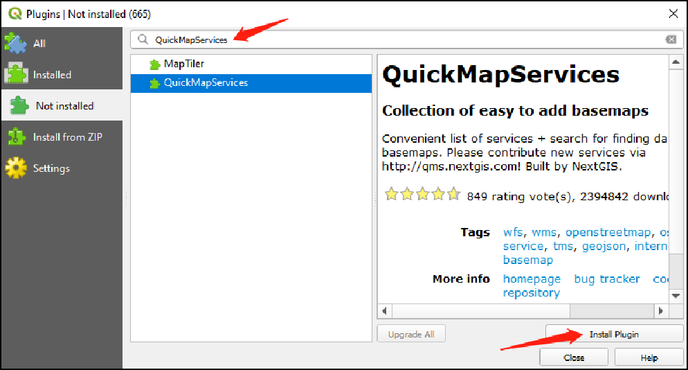
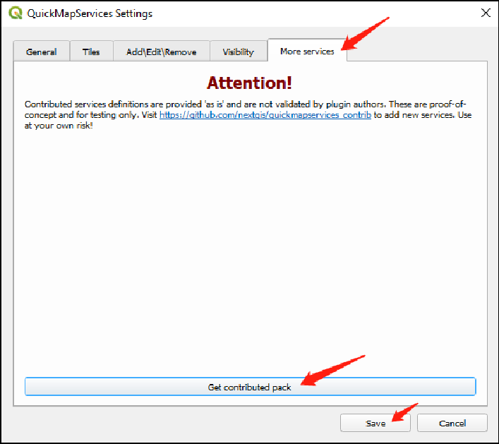
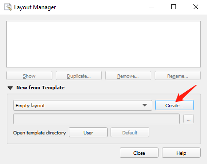

# Module 1 - Software and Data Preparation

**What will you learn from this module?**

- Installing QGIS and PyLUSAT (Python for Land Use Suitability Analysis Tools),
- Introducing the interface of QGIS 3.10.8,
- Visualizing the datasets prepared for this series of trainings in QGIS.

---

## 1. Software Installation

> :pushpin: 
> Follow the [instruction](https://github.com/SERVIR-WA/GALUP/wiki/Install)
> to install [QGIS 3.10.8](https://qgis.org/en/site/) and
> [PyLUSAT v0.4.0](https://pypi.org/project/pylusat/) package, which
> must be installed before we can successfully load and run the tools GALUP
> have developed.

## 2. Using QGIS to Create Maps

We will explore the QGIS user interface so that you are familiar with the
menus, toolbars, map canvas and layers list that form the basic structure of
the interface.

### 2.1 The QGIS User Interface

[Elements](https://docs.qgis.org/3.10/en/docs/training_manual/basic_map/overview.html)
of the QGIS GUI (Graphic User Interface).

- Layers List / Browser Panel
- Toolbars
- Map canvas
- Status bar
- Side Toolbar
- Locator bar

You can also customize the QGIS GUI to fits your own preferences and needs.

### 2.2 Add data to _map canvas_ （GY）
[Browser panel](https://docs.qgis.org/3.10/en/docs/user_manual/introduction/browser.html?highlight=favoriate#the-browser-panel) in QGIS can let you easily navigate in your filesystem and manage geodata.
- drag and drop the target files from brower panel into the map canvas
- explore the [interface](https://docs.qgis.org/3.10/en/docs/user_manual/managing_data_source/opening_data.html?highlight=browser%20panel#exploring-the-interface) and interact with the [Browser items](https://docs.qgis.org/3.10/en/docs/user_manual/managing_data_source/opening_data.html?highlight=browser%20panel#interacting-with-the-browser-items)
- add the data you frequently used to [Favorites](https://docs.qgis.org/3.10/en/docs/training_manual/basic_map/overview.html?highlight=favoriate#basic-the-browser-panel)

### 2.3 Open the _Attribute Table_ to review your data (SL)

- Put the cursor on a layer of your interest, and right click the layer and
  click _Open Attribute Table_.
- The title of the Attribute Table window includes the name of the layer, the
  total number of the features in the layer, the number of features are
  filtered, and the number of features are selected. You can find the
  attributes of all features in the layer.

### 2.4 Symbology (GY)
The symbology of a layer is one of important functions in GIS. By presenting the data with a dynamic visual appearance on the map, you can better explore the data as you are working with it.
- symbolize the vector layers using the [symbology](https://docs.qgis.org/3.10/en/docs/training_manual/basic_map/symbology.html?highlight=symbology#basic-fa-changing-colors) tab in the layer properties
- choose the [Categorized option](https://docs.qgis.org/3.10/en/docs/user_manual/working_with_vector/vector_properties.html?highlight=single%20color#categorized-renderer) to present the data, if you have data that is broken into categories (i.e. male or female, hair color, political party, etc.)
- choose the [Graduated option](https://docs.qgis.org/3.10/en/docs/user_manual/working_with_vector/vector_properties.html?highlight=single%20color#graduated-renderer) to present the data, if you have numeric data you want to symbolize (i.e. total population)

### 2.5 Add a _Basemap_ to the canvas

- To add a basemap to the map canvas, in QGIS, we need to install a
  [QGIS plugin](https://docs.qgis.org/3.10/en/docs/user_manual/plugins/plugins.html).
  - Go to the menu toolbar,
  - Click _Plugins_, and
  - Click _Manage and Install Plugins..._.
  
- In the **Plugin** Window, search for **QuickMapServices** then click Install
  button 
- After installlation, you should be able to find the _QuickMapServices_ button
  in the Web Toolbar. 
- Click the _QuickMapServices_ button and click _Settings_.
- In the **QuickMapServices Settings** window, click the _More Services_ tab,
  and click _Get contributed pack_ to get more basemaps.
  
- Now try to click the _QuickMapServices_ button again, and you will see more
  basemap options.
  
### 2.6 Create a _Layout_ to print your map

- After setting up the map, you are now ready to print it (as a pdf file) to
  share with your colleagues. You can click the _Show Layout Manager_ button on
  the **Project Toolbar** to open the **Layout Manager** window (or you can
  click the _Project_ button on the menu bar and click _Layout Manager..._).
- In the **Layout Manager** window, click the _Create..._ button, and name your
  map and click _OK_ to open the map window.
  
- In the map window, click the _Add Item_ button on the main menu bar, and
  click add map. Select an area to render your map.
  
- In order to have a decent map, you might need _Add Label_ to set the name of
  your map, _Add Legend_ to identify the elements in the map, _Add Scale Bar_
  to use a scale bar to indicates the scale of the map, _Add North Arrow_ to
  add a north arrow. You can add these items under the _Add Item_ button.
- You can edit the items you added at windows the right side. 
  
- After you finishing all the layout of your map, click the _Layout_ button on
  the main menu bar, and click _Export as PDF..._ to export your map.
  
## 3. Get to know the datasets

- [Download](https://github.com/chjch/lucis_qgis) the datasets from GitHub
- Open data in QGIS
- Change the symbology of the dataset

## 4. Exercises

- Please complete the exercise [here](https://github.com/chjch/lucis_qgis).

## 5. Additional Resources

- [What is GIS and why use QGIS](https://www.youtube.com/watch?v=8oEnJvLzDnQ)
- [QGIS User Guide](https://docs.qgis.org/3.16/en/docs/user_manual/)

## 6. Post-training Survey

Upon completion, please take this [survey](https://docs.google.com/document/d/1p1oy635ZMgXBcyxPJPv2Je-62xTVaNV6xCtltQYvde0/edit) to summarize what you have
learned and also help us improve this tutorial.

## 7. What's Next?

Module 2 - Introduction to LUCISOPEN Tools