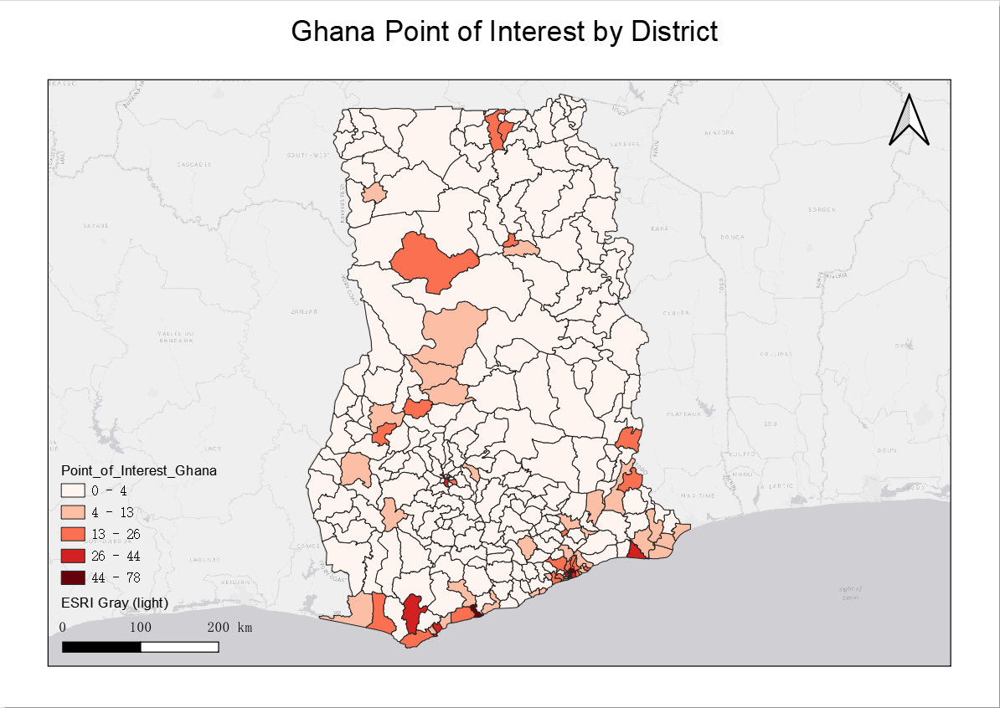
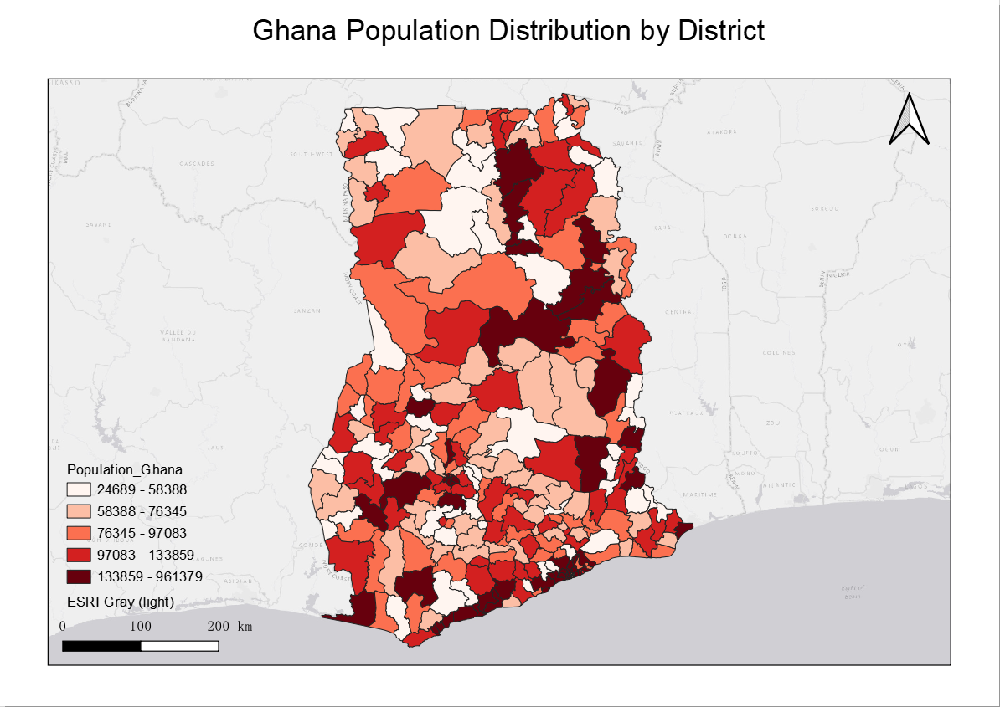
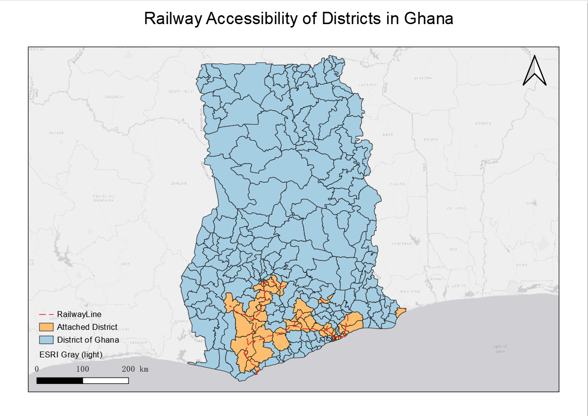

# Module 2 - Introduction to LUCIS-OPEN Tools for QGIS

**What will you learn from this module?**

- Get to know the function of each LUCIS-OPEN Tools for QGIS,
- Be familiar with the parameters of Tools,
- Process data with appropriate Tools.

## 1. GIS Datasets

- The table below lists the GIS datasets used for this module.
- They can be found within the downloaded _zip_ folder from the previous
  section at `GALUP-master -> training -> 1_lu -> datasets`.

| ID | File Name   | Data Format | Type    | Description  |
|----|------------|-------------|---------|-----------------------------|
| 1  | pop_landsat_2018_THLD.shp     | raster      | tiff    | Twifo/Heman/Lower Denkyira District Population            |
| 2  | THLD_Boundary.shp             | vector      | polygon | Twifo/Heman/Lower Denkyira District Boundary              |
| 3  | THLD_poly.shp                 | vector      | polygon | Twifo/Heman/Lower Denkyira District Administrative Region |
| 4  | osm2020_allrds_THLD.shp       | vector      | line    | Road Network                                              |
| 5  | Health_Facilities.shp       | vector      | line    | Road Network                                              |
| 6  | Drain_THLD100.tif             | raster      | tiff    | [Soil Drainage](https://data.isric.org/geonetwork/srv/eng/catalog.search#/metadata/953d0964-6746-489a-a8d1-f188595516a9)                                             |
| 7  | RZD_THLD100.tif               | raster      | tiff    | [Root Zone Depth](https://data.isric.org/geonetwork/srv/eng/catalog.search#/metadata/c77d1209-56e9-4cac-b76e-bbf6c7e3a617)                                           |
| 8 | Slope_Percent.tif              | raster      | tiff    | Slope Percent                                             |
| 9 | SD0_5.tif                     | raster      | tiff    | [Soil PH 0-5](https://data.isric.org/geonetwork/srv/eng/catalog.search#/metadata/a3364e47-9229-4a6d-aed2-487fd7e4dccc)1                                                |
| 10 | SD5_15.tif                    | raster      | tiff    | Soil PH 5-151                                             |
| 11 | SD15_30.tif                   | raster      | tiff    | Soil PH 15-301                                          |
| 12 | SD30_60.tif                   | raster      | tiff    | Soil PH 30-601                                              |
| 13 | SD60_100.tif                  | raster      | tiff    | Soil PH 60-1001                                          |
| 14 | SD100_200.tif                 | raster      | tiff    | Soil PH 100-2001                          |
| 15 | iSDA_MGRS.tif                 | raster      | tiff    | [Land Cover Type Ghana 2019](https://www.isda-africa.com/isdasoil/)   |
|Note:| 1. Same data source

## 2. Get to Know LUCIS-OPEN Tools for QGIS

### 2.1 Density of Line Features

#### **Summary**
Calculates a magnitude-per-unit area from polyline features that fall within a radius around each input vector feature.
#### **Parameters**
For the parameters setting for the Density of Line Features tool, please click [here](https://github.com/SERVIR-WA/GALUP/wiki/Tools#density-of-line-features).
#### **Applications**

### 2.2 Distance to Point Features

#### **Summary**
Calculates distance between the input vector features and the closest point feature.
#### **Parameters**
For the parameters setting for the Distance to Point Features tool, please click [here](https://github.com/SERVIR-WA/GALUP/wiki/Tools#distance-to-point-features).
#### **Applications**

### 2.3 Reclassify Field

#### **Summary**
Reclassify a field in the input table based on predefined rules and store the translated values in a new field.
#### **Parameters**
For the parameters setting for the Reclassify Field tool, please click [here](https://github.com/SERVIR-WA/GALUP/wiki/Tools#reclassify-field).
#### **Applications**

### 2.4 Spatial Join

#### **Summary**
The spatial join tool can join attributes from the join features to the target features based on specified spatial relationship.

#### **Parameters**
For the parameters setting for Spatial Join tool, pleasae click [here](https://github.com/SERVIR-WA/GALUP/wiki/Tools#spatial-join).

#### **Applications**
Spatial joins begin by selecting a target feature and comparing it spatially to other feature layers (_**Intersect**_, _**Contains**_, _**Within**_). The Spatial Join tool inserts the columns from one feature table to another if and only if the two features share the same spatial reference. In a case that you have multiple features that you want to combine into a target feature, you can choose _**Join one to many**_ option to create multiple overlapping records that each duplicate record contains the records from the joining features. Or you can choose _**Join one to one**_ option to merge the multiple records from joining features for each single target feature. 

For example, you have a set of points of interest within different districts in Ghana. By running a spatial join, you can transfer the points of interest table columns into the district layer, and then _**count**_ the number of records in each district. By using the Spatial Joing tool, you can find out the number of points of interest in each distircts of Ghana.

|         Parameters setting     |       Result        |
|:---------------------------------------:|:---------------------------------------------:|
|    |     |

### 2.5 Zonal Statistics

#### **Summary**
The Zonal Statistics tool calculate statistics on values of raster within the zones of another dataset.

#### **Parameters**
For the parameters setting for Zonal Statistics tool, pleasae click [here](https://github.com/SERVIR-WA/GALUP/wiki/Tools#zonal-statistics).

#### **Applications**
Zonal Statistics calculates statistics for specified zones based on values from another dataset (rasater dataset). It can calculate the mean, median, sum, minimum, maximum, standard deviation, majority, minority, unique, or range in each zone. Here is an example when you would use this operation: if you have a population raster dataset and you want to know how many population are in each district of Ghana, you can run Zonal Statistics to find out the distribution of population in Ghana.

|         Parameters setting     |       Result        |
|:---------------------------------------:|:---------------------------------------------:|
|    |     |

### 2.6 Select by Location

#### **Summary**
The Select by Location tool can select part of the input Layer based on its spatial relationship with the selecting layer.

#### **Parameters**
For the parameters setting for Select by Location tool, pleasae click [here](https://github.com/SERVIR-WA/GALUP/wiki/Tools#select-by-location).

#### **Applications**
The Select By Location tool allows you to select features based on their location relative to features in another layer. For instance, you may want to know how many districts of Ghana can access to the railway service, so you could select all the districts within the 100 kilometer buffer of railway line.

|         Parameters setting     |       Result        |
|:---------------------------------------:|:---------------------------------------------:|
|    |     |

## 3. Exercises

- Please complete the [Exercise 1](). # Density of Line
- Please complete the [Exercise 2](). # Distance to Point Features
- Please complete the [Exercise 3](). # Reclassify Field
- Please complete the [Exercise 4](). # Spatial Join & Zonal Statistics