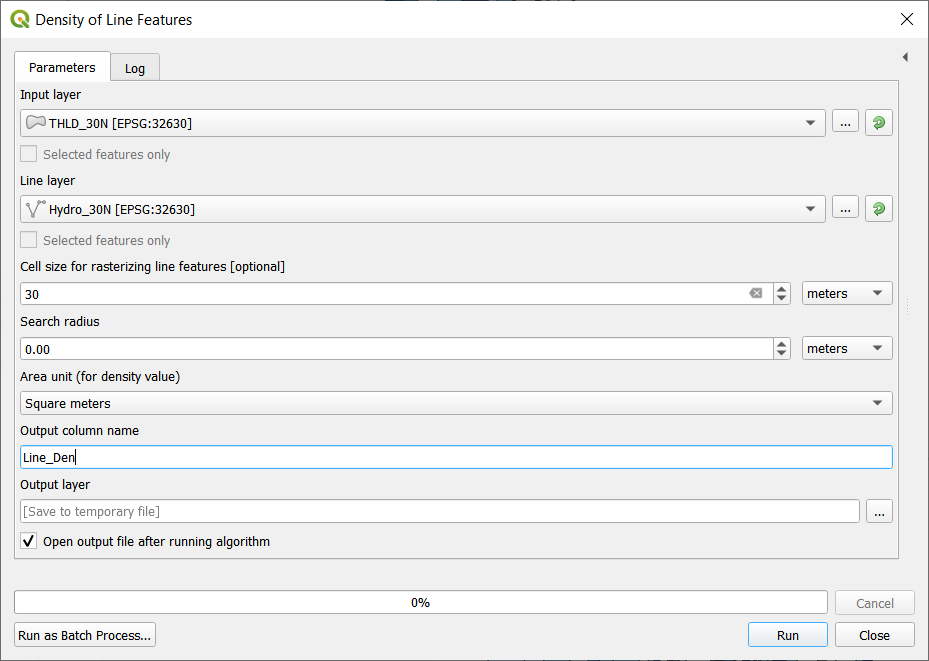
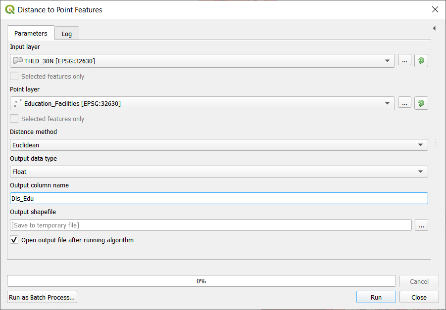
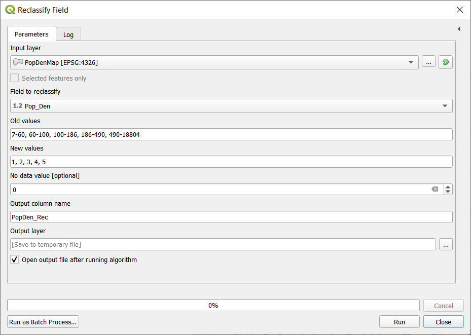
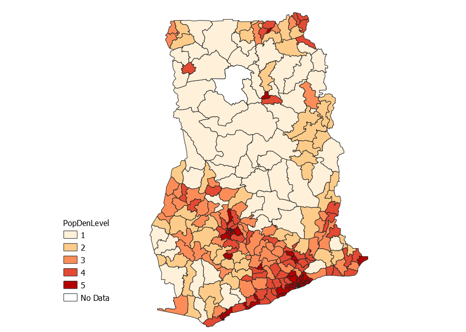
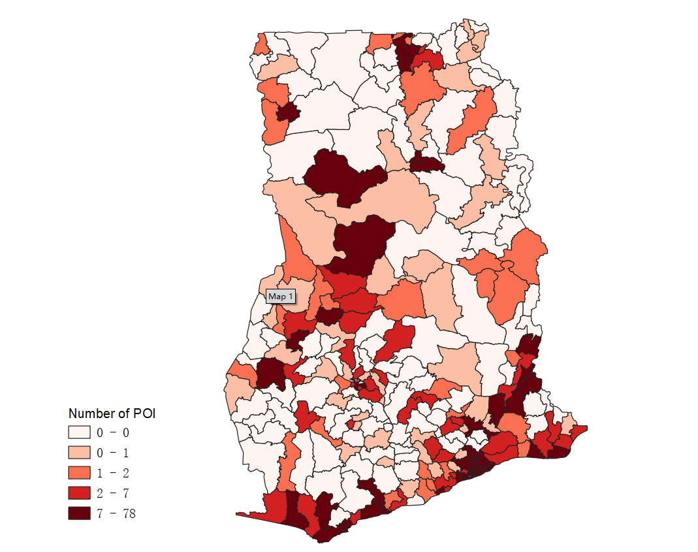

# Module 2 - Introduction to LUCIS-OPEN Tools for QGIS

**What will you learn from this module?**

- Get to know the LUCIS-OPEN Tools for QGIS,
- Learn when and how to use different tools,
- Use the tools to answer planning-related questions.

## 1. Density of Line Features

_Density of Line Features_ calculates the line density in a polygon (i.e., the
total length of line features that fall within a polygon feature divided by the
polygon's area).
The polygon features (i.e., Input layer) and line features (i.e., Line layer)
are two required parameters for using this tool. There are five additional
parameters can be specified, please check
[here](https://github.com/SERVIR-WA/GALUP/wiki/Tools#density-of-line-features).

### 1.1 Usage

This tool is often used to calculate the density of linear features, such as roads and rivers, in a polygon area. Results of this tool can help us understand the magnitude of a certain phenomenon within a territory.

Only the portion of a line within the neighborhood (a polygon feature or a
radius around a polygon feature) is considered when calculating the density.
If no lines fall within the neighborhood of a particular polygon, a
"[Null value](https://www.cadlinecommunity.co.uk/hc/en-us/articles/360013744338-QGIS-NULL-Values#:~:text=By%20default%2C%20when%20you%20browse,will%20show%20a%20NULL%20value.)" will be given to that polygon.

Search radius, if specified, will be used to calculate the line density by using the total length of line features fall within the area of a circle (the centroid of a polygon as the center and the search radius as the radius) divided by the circle's area.

[Cell size](https://desktop.arcgis.com/en/arcmap/10.3/manage-data/raster-and-images/cell-size-of-raster-data.htm) is used to calculate the total length of line features fall within the area of a circle by rasterizing those line features. The smaller the value, the more precise the outcome, but the longer time will be taken to run the tool.

### 1.2 Example

In the following example, we use this tool to calculate the density of
underground water veins in the THLD area. The datasets used are listed below:

| ID | File Name     | Data Format | Type    | Description                                                 |
|----|---------------|-------------|---------|-------------------------------------------------------------|
| 1  | THLD_poly.shp | vector      | polygon | IDUs1 in the THLD2 District Assembly |
| 2  | Hydro.shp     | vector      | line    | Underground water veins in the THLD District                |

1: Integrated Decision Unit.  
2: Twifo-Hemang-Lower-Denkyira.

The two figures below display the specific parameter settings
 and the output of the tool. 
> :pushpin: Check the details of an image: 
> If you can't see the image clearly, click on the image to view it in a
> new page, which will show the image in its original size.

|          Parameter Setting         |    Output Map   |
|:------------------------------------------:|:------------------------------------------:|
|  |  |

In the output map, we used **Blues** [Graduated Color](https://github.com/SERVIR-WA/GALUP/blob/master/training/1_lu/modules/module1.md#33-change-symbology-of-a-layer) to indicate different ranges of the line density (per square meter). Specifically, the darker the blue the higher the density of underground water veins.

## 2. Distance to Point Features

_Distance to Point Features_ calculates the distance between an input feature and its nearest point feature in another layer. The polygon features (i.e., Input layer) and point features (i.e., Point layer) are two required parameters for using this tool. There are four additional parameters can be specified, please check [here](https://github.com/SERVIR-WA/GALUP/wiki/Tools#distance-to-point-features).

### 2.1 Usage

This tool is often used to calculate the distance of the nearest point feature around a vector feature. For example, this tool can be used to find the nearest school or the nearest hospital around each residential area.

In the Distance method, [Euclidean Distance](https://en.wikipedia.org/wiki/Euclidean_distance) and
[Manhattan Distance](https://en.wikipedia.org/wiki/Taxicab_geometry) are two different methods to measure the distance between an input feature and its nearest point feature.

### 2.2 Example

In the following example, we use the tool to calculate the distance between each polygon in THLD area and its nearest education facility. The datasets used are listed below:

| ID | File Name     | Data Format | Type    | Description                                                 |
|----|---------------|-------------|---------|-------------------------------------------------------------|
| 1  | THLD_poly.shp | vector | polygon | IDUs in the THLD District Assembly |
| 2  | Education_Facilities.shp | vector | point | Education facilities in THLD District |

The two figures below display the specific parameter settings
 and the output of the tool.

|          Parameter Setting         |    Output    |
|:------------------------------------------:|:------------------------------------------:|
|  |  |

## 3. Reclassify Field

_Reclassify Field_ reclassifies a field in the input table based on predefined rules and store the translated values in a new field. The input table (i.e., Input layer), the field to be reclassified (i.e., Field to reclassify), the predefined rules (i.e., Old values and New values), and the new field (i.e., Output column name) are required parameters. There are two additional parameters can be specified, please check [here](https://github.com/SERVIR-WA/GALUP/wiki/Tools#reclassify-field).

### 3.1 Usage

This tool is used to reclassify or change the values of the feature to alternative values.

Old values are the values (or value ranges) you want to reclassify, the New values is the values that will be assigned to the old values. For example, a vector of soil type may be assigned new values of 1 to 10 to represent erosion potential.

No data value is the new value that will be assigned to the no data value. In most cases, the no data value will be 255, so the new value 0 (default setting of No data value) will replace the old value 255 in the field after running the tool.

This tool is useful when you are trying to do a suitability model, it allows you to assign new values to different evaluation indicators under a same scoring system (e.g., 1 to 10) on which the final weighting step will be based.

### 3.2 Example

Recall that, in Exercise 2 of Module 1, we calculated the population density of Ghana by district in 2018. In the following example, in order to know the population density level of the Ghana by district in 2018, we use the Reclassify Field tool to reclassify the population density of the Ghana by district in 2018 according to the criteria that old values: 7-60, 60-100, 100-186, 186-490, and 490-18804 will be assigned new values: 1, 2, 3, 4, 5, respectively. The datasets used are listed below:

| ID | File Name     | Data Format | Type    | Description                                                 |
|----|---------------|-------------|---------|-------------------------------------------------------------|
| 1  | Gh_260_MMDA.shp                  | vector      | polygon | Districts of Ghana              |

The two figures below display the specific parameter settings and the output
of the tool.

|          Parameter Setting         |    Output   |
|:------------------------------------------:|:------------------------------------------:|
|  |  |

## 4. Spatial Join
  _Spatial Join_ evaluates spatial relationships (i.e., **Intersect**,
  **Contains**, **Within**) between features in the **Target Layer** and the **Join Layer**.
  The tool joins the columns from the **Join Layer** to the **Target Layer** if
  any two features, one from each layer (we call them "matched" for each other),
  satisfy the specified spatial relationship. There are three additional parameters
  can be specified, please check [here](https://github.com/SERVIR-WA/GALUP/wiki/Tools#spatial-join). 

  When there are multiple "matched" features in the **Join Layer**, you can
  choose either **Join one to many** or **Join one to one**.
  If **Join one to many** is selected, features in the **Target Layer**
  will be duplicated multiple times (as many as the number of "matched"
  features) to combine with each "matched" feature in the **Join Layer**.
  On the contrary, if  **Join one to one** is selected, all "matched"
  features in the **Join Layer** will be aggregated, and then combined with
  a target feature. 

### 4.1 Usage
_Spatial Join_ matches rows from the Join Features to the Target Features based
on their relative spatial locations.

This tool take a step further to specify the column you are interested from the
Join Layer and then calculate particular statistics (i.e., **first**, **last**,
**sum**, **mean**, **median**, **max**, **min**, **std**, **var**, **count**).

### 4.2 Example
 In the following example, we choose the **Join one to one** option to find
  out the **count** (number of records) of points of interest (tourism)
  within each District Assembly of Ghana.
  The datasets used are listed below:

| ID | File Name           | Data Format | Type    | Description                                                 |
|----|---------------------|-------------|---------|-------------------------------------------------------------|
| 1  | Gh_260_MMDA.shp     | vector      | polygon | Districts of Ghana               |
| 2  | PointOfInterest.shp | vector      | point   | Point of interest in Ghana       |

  The two figures below display the specific parameter settings and the output of the tool.
|         Parameters setting     |       Output        |
|:------------------------------:|:------------------------------------------:|
|    |     |

In the output map,  we used Reds
[Graduated Color](https://github.com/SERVIR-WA/GALUP/blob/master/training/1_lu/modules/module1.md#33-change-symbology-of-a-layer)
to indicate different ranges of the number of point of interest in Ghana.
Specifically, the darker the red the higher the number of point of interest.

## 5. Zonal Statistics
  _Zonal Statistics_ calculates statistics (i.e., **mean**, **median**,
  **sum**, **minimum**, **maximum**, **standard deviation**, **majority**,
  **minority**, **unique**, **range**) on values of **Raster Layer** within the
  zones of **Input Layer**.
  There are three additional parameters can be specified, please check
  [here](https://github.com/SERVIR-WA/GALUP/wiki/Tools#zonal-statistics). 

### 5.1 Usage
This tool is often used to calculates statistic on values you are interested from
**Raster Data** within the zones defined by **Input Layer**.

### 5.2 Example

In the following example, we use this tool to **sum** population based
on values of raster dataset within each district of Ghana to show the
distribution of population in Ghana.

  The datasets used are listed below:

| ID | File Name           | Data Format | Type    | Description                                                 |
|----|---------------------|-------------|---------|-------------------------------------------------------------|
| 1  | Gh_260_MMDA.shp               | vector      | polygon | Districts of Ghana              |
| 2  | population_gha_2018-10-01.tif | raster      | tiff    | Population of Ghana in 2018     |

  The two figures below display the specific parameter settings and the output of the tool.

|         Parameters setting     |       Output        |
|:---------------------------------------:|:---------------------------------------------:|
|    |     |

In the output map,  we used Reds [Graduated Color](https://github.com/SERVIR-WA/GALUP/blob/master/training/1_lu/modules/module1.md#33-change-symbology-of-a-layer) to indicate different ranges of the number of population in Ghana. Specifically, the darker the red the higher the number of population.

## 6. Select by Location
_Select By Location_ allows you to select features from **Input layer** based on
their location relative (i.e., **Intersect**, **Contains**, **Within**, **Within a distance**)
to features in **Selection layer**. There are two additional parameters can be specified, please check
  [here](https://github.com/SERVIR-WA/GALUP/wiki/Tools#select-by-location). 

### 6.1 Usage
This tool is often used to select features spatially relative to the feature you
are interested in.

### 6.2 Example
In the following example, we use this tool to select all the districts attached
with the 100-kilometer buffer of the railway line in Ghana.

  The datasets used are listed below:

| ID | File Name           | Data Format | Type    | Description                                                 |
|----|---------------------|-------------|---------|-------------------------------------------------------------|
| 1  | Gh_260_MMDA.shp             | vector      | polygon | Districts of Ghana              |
| 2  | RailwayLine.shp             | vector      | line    | Railway line in Ghana           |

  The two figures below display the specific parameter settings and the output of the tool.

|         Parameters setting     |       Output        |
|:---------------------------------------:|:---------------------------------------------:|
|    |     |

In the output map, we used Green color to indicate the served area of railway in Ghana.

## 7. Exercises and Post-training Survey

- Please complete the [Exercise 1](https://github.com/SERVIR-WA/GALUP/blob/master/training/1_lu/exercises/m2_exercise1.md).
- Please complete the [Exercise 2](https://github.com/SERVIR-WA/GALUP/blob/master/training/1_lu/exercises/m2_exercise2.md).
- Please complete the [Exercise 3](https://github.com/SERVIR-WA/GALUP/blob/master/training/1_lu/exercises/m2_exercise3.md).
- Please complete the [Exercise 4](https://github.com/SERVIR-WA/GALUP/blob/master/training/1_lu/exercises/m2_exercise4.md).
- Please take this post-training
  [survey](https://ufl.qualtrics.com/jfe/form/SV_3n21W1ko0UPJNLo) (required).
- Please submit your exercises [here](https://github.com/SERVIR-WA/GALUP/issues/new?assignees=muribasterra&labels=exercise+w1m2&milestone=Module+2+Exercises&template=w1m2-exercise-submission.md&title=Module+2+exercises+%5Breplace+with+your+name%5D).

## 8. What's Next?

Module 3 - Create Suitability Models with QGIS Graphical Modeler.