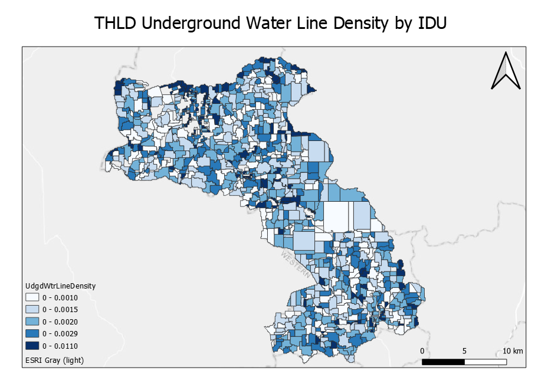
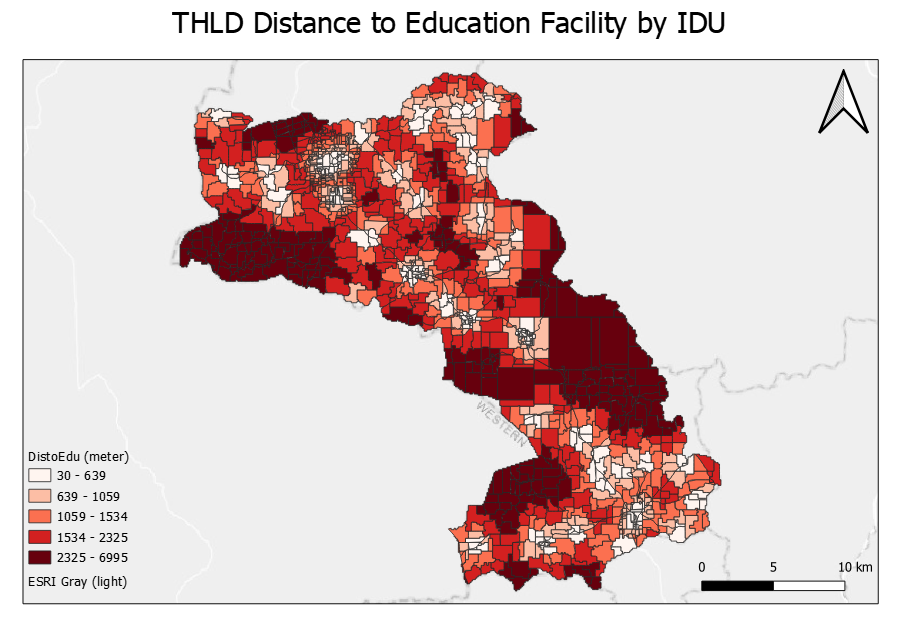
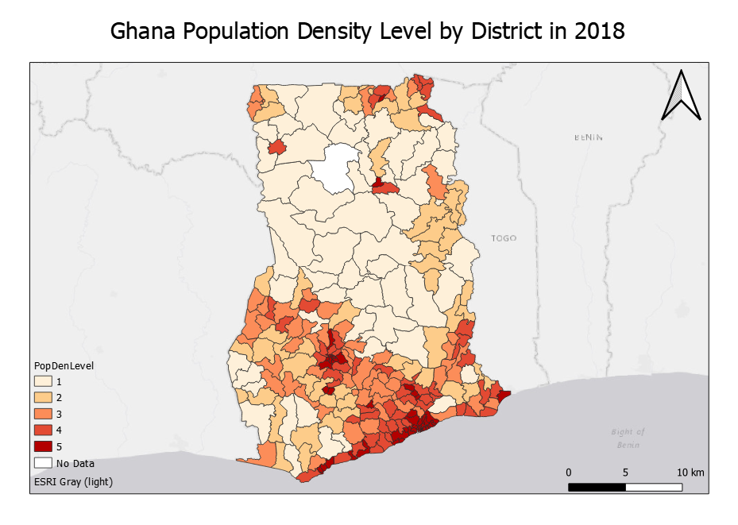

# Module 2 - Introduction to LUCIS-OPEN Tools for QGIS

**What will you learn from this module?**

- Get to know the function of each LUCIS-OPEN Tools for QGIS,
- Be familiar with the parameters of Tools,
- Process data with appropriate Tools.

## 1. Get to Know the Datasets

- The table below lists the GIS datasets used for this module.
- They can be found within the downloaded _zip_ folder from the previous
  section at `GALUP-master -> training -> 1_lu -> datasets`.

| ID | File Name   | Data Format | Type    | Description  |
|----|------------|-------------|---------|-----------------------------|
| 1  | pop_landsat_2018_THLD     | raster      | tiff    | Twifo/Heman/Lower Denkyira District Population            |
| 2  | THLD_Boundary             | vector      | polygon | Twifo/Heman/Lower Denkyira District Boundary              |
| 3  | THLD_poly                 | vector      | polygon | Twifo/Heman/Lower Denkyira District Administrative Region |
| 4  | osm2020_allrds_THLD       | vector      | line    | Road Network                                              |
| 5  | Drain_THLD100             | raster      | tiff    | [Soil Drainage](https://data.isric.org/geonetwork/srv/eng/catalog.search#/metadata/953d0964-6746-489a-a8d1-f188595516a9)                                             |
| 6  | RZD_THLD100               | raster      | tiff    | [Root Zone Depth](https://data.isric.org/geonetwork/srv/eng/catalog.search#/metadata/c77d1209-56e9-4cac-b76e-bbf6c7e3a617)                                           |
| 7 | Slope_Percent              | raster      | tiff    | Slope Percent                                             |
| 8 | SD0_5                     | raster      | tiff    | [Soil PH 0-5](https://data.isric.org/geonetwork/srv/eng/catalog.search#/metadata/a3364e47-9229-4a6d-aed2-487fd7e4dccc)1                                                |
| 9 | SD5_15                    | raster      | tiff    | Soil PH 5-151                                             |
| 10 | SD15_30                   | raster      | tiff    | Soil PH 15-301                                          |
| 11 | SD30_60                   | raster      | tiff    | Soil PH 30-601                                              |
| 12 | SD60_100                  | raster      | tiff    | Soil PH 60-1001                                          |
| 13 | SD100_200                 | raster      | tiff    | Soil PH 100-2001                          |
| 14 | iSDA_MGRS                 | raster      | tiff    | [Land Cover Type Ghana 2019](https://www.isda-africa.com/isdasoil/)   |
|Note:| 1. Same data source

## 2. Get to Know LUCIS-OPEN Tools for QGIS

### 2.1 Density of Line Features

#### **Summary**
Calculates a magnitude-per-unit area from polyline features that fall within a radius around each input vector feature.
#### **Parameters**
For the parameters setting for the Density of Line Features tool, please click [here](https://github.com/SERVIR-WA/GALUP/wiki/Tools#density-of-line-features).
#### **Applications**
The Density of Line Features tool is used to calculate the line density in a polygon (i.e., calculating the total length of line in a polygon divided by the area of the polygon). Only the portion of a line within the neighborhood is considered when calculating the density. If no lines fall within the neighborhood at a particular polygon, that polygon is assigned "Null".

This tool is often used to calculate the roads network density in planning.

In the following example, we use the Density of Line Features tool to calculate the underground water line density of the THLD area. The figures below shows the parameter setting of the tool and an output map of the underground water line density of the THLD area.

|          Parameter Setting         |    Output Map    |
|:------------------------------------------:|:------------------------------------------:|
|  |  |

### 2.2 Distance to Point Features

#### **Summary**
Calculates distance between the input vector features and the nearest point feature.
#### **Parameters**
For the parameters setting for the Distance to Point Features tool, please click [here](https://github.com/SERVIR-WA/GALUP/wiki/Tools#distance-to-point-features).
#### **Applications**
The Distance to Point Features tool is often used to find the nearest location (point feature) around a polygon feature. For example, this tool can be used to find the nearest school around each residential area or used to find the nearest hospital of each census tract.

In the following example, we use the Distance to Point Features tool to calculate the distance between each polygon of THLD area and the nearest education facility. The figures below shows the parameter setting of the tool and an output map of the distance to the education facility of the THLD area.

|          Parameter Setting         |    Output Map    |
|:------------------------------------------:|:------------------------------------------:|
|  |  |

### 2.3 Reclassify Field

#### **Summary**
Reclassify a field in the input table based on predefined rules and store the translated values in a new field.
#### **Parameters**
For the parameters setting for the Reclassify Field tool, please click [here](https://github.com/SERVIR-WA/GALUP/wiki/Tools#reclassify-field).
#### **Applications**
The Reclassify Field tool reclassifies or change the values of the feature to alternative values. For example, a vector of soil type may be assigned values of 1 to 10 to represent erosion potential. The Reclassify Field tool is useful when you are trying to do a building suitability model, it allow you to assign new values to different evaluation indicators under a same scoring system on which the final weighting step will be based.

Recall that, in Exercise 2 of Module 1, we calculated the population density of Ghana by district in 2018. In the following example, in order to know the population density level of the Ghana by district in 2018, we use the Reclassify Field tool to reclassify the population density of the Ghana by district in 2018 according to the criteria below.

| Old Value| New Value|
  |----------------------|---------------------|
  | 7-60 | 1|
  | 60-100| 2|
  | 100-186|3|
  | 186-490|4|
  | 490-18804| 5|

The figures below shows the parameter setting of the tool and an output map of the population density level of the Ghana by district in 2018.

|          Parameter Setting         |    Output Map    |
|:------------------------------------------:|:------------------------------------------:|
|  |  |

### 2.4 Spatial Join

#### **Summary**
Join attributes from the join features to the target features based on specified spatial relationship.
#### **Parameters**
For the parameters setting for Spatial Join tool, pleasae click [here](https://github.com/SERVIR-WA/GALUP/wiki/Tools#spatial-join).

#### **Applications**
The spatial join tool inserts the columns from one feature table to another based on location or proximity. For example, when you have a set of land parcels, and each land parcel has a point inside of it. By running a spatial join, you can transfer the point table columns into the land parcel layer.

### 2.5 Zonal Statistics

#### **Summary**
Calculate statistics on values of raster within the zones of another dataset.
#### **Parameters**
For the parameters setting for Zonal Statistics tool, pleasae click [here](https://github.com/SERVIR-WA/GALUP/wiki/Tools#zonal-statistics).

#### **Applications**
Zonal Statistics uses groupings to calculate statistics for specified zones. It can calculate the mean, median, sum, minimum, maximum, or range in each zone. Here are some examples when you would use this operation in GIS:
1. Summing Rain in a Watershed – If you want to find out how much rain is in a watershed, you can use a zonal operation like this one. By using a precipitation raster as your value field, you can set your zone as the watersheds with a sum function.
2. Highest Elevation in Country – If you have an elevation raster dataset, you can run Zonal Statistics to find out its highest peak by using the maximum function.
3. Adding Tree Cover in an Ecozone – To find the tree cover area in an ecozone, you can run Zonal Statistics to sum a raster land cover dataset.

## 3. Exercises

- Please complete the [Exercise 1](). # Density of Line (road density)
- Please complete the [Exercise 2](). # Distance to Point Features (distance to health facility)
- Please complete the [Exercise 3](). # Select by location  (within the 5 miles buffer of the education facility)
- Please complete the [Exercise 4](). # Reclassify Field & Zonal Statistics (a kind of crops, reclassify soil PH)