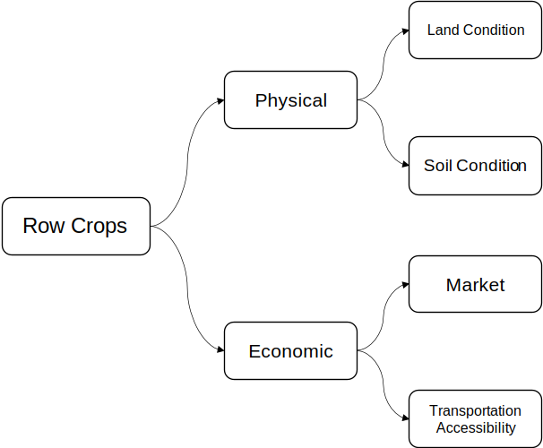
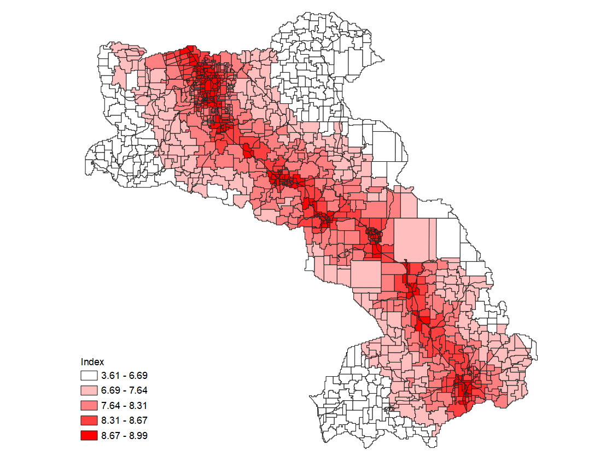
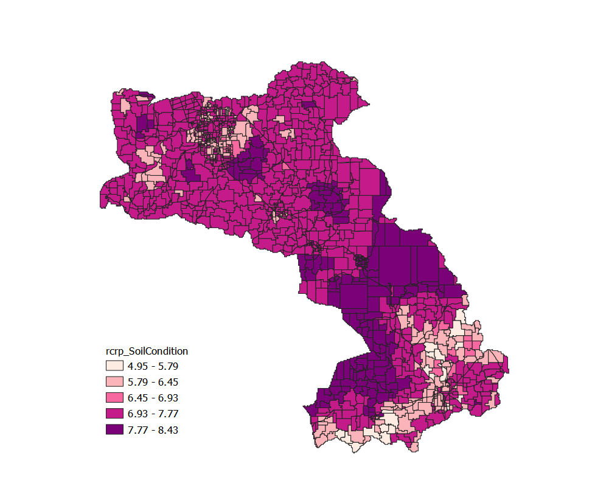

# Module 3 - Create Suitability Models with QGIS Graphical Modeler

**What will you learn from this module?**

- Understand the general workflow of suitability modeling,
- Get to know the QGIS **Graphical Modeler**,
- Learn how to build suitability models with LUCIS-OPEN tools for QGIS in the
  Graphical Modeler,
- Learn the details and the logic behind the suitability models for
  ***Row Crops***.

## 1. Land-use Suitability Modeling

**Suitability** is a measure of the *relative degree* to which a land unit is
suitable for a <ins>specified purpose</ins>.
The decision on suitability is based strictly on its **current condition** and
**the context** in which it is found.
It neither anticipates nor requires any change for the assignment of a
suitability score.
Suitability modeling is the process of determining ***suitability***.
In this module, we present a method of suitability modeling in **QGIS** using
**LUCIS-OPEN Tools for QGIS** and the **Graphical Modeler**.

The **general workflow** of suitability modeling consists of three steps:

1. [Define criteria](https://github.com/SERVIR-WA/GALUP/blob/master/training/1_lu/modules/module3.md#step-1-define-criteria)
2. [Transform to a common suitability scale](https://github.com/SERVIR-WA/GALUP/blob/master/training/1_lu/modules/module3.md#step-2-transform-to-a-common-suitability-scale)
3. [Weight the criteria and create a suitability map](https://github.com/SERVIR-WA/GALUP/blob/master/training/1_lu/modules/module3.md#step-3-weight-the-criteria-and-create-a-suitability-map)

### 1.1 Define Criteria

The first step to create a suitability model is to identify the criteria for
the subject of the model.
Each criterion identified should be instrumental in reaching the overall goal
of the model.
For example, if we want to locate a suitable site for an orchard, we might
consider four criteria:

- Soil permeability
- Distance to major roads
- Land value per unit area
- Current land use

### 1.2 Transform to a Common Suitability Scale

All four criteria mentioned above affect, although in different magnitudes,
how a land parcel is suitable for an orchard.
Therefore, to determine suitability for orchards, we need to combine these
criteria in *a meaningful way*.
However, criteria are often measured with
**different [measurement levels](https://tinyurl.com/jh8n7hzh)**
(*nominal*, *ordinal*, *interval*, and *ratio*) at **different scales**.
Hence, transformations to each criterion from its original scale to
<ins>a common suitability scale</ins> are needed.
In theory, you can choose any arbitrary interval for such
**suitability scale**.
But, to follow the convention of the
**Land-Use Conflict Identification Strategy** (LUCIS), we will use a scale of
<b><ins>1 to 9</ins></b> throughout this workshop, where 1 represents lowest
suitability and 9 represents highest suitability.

In general, there are three transformation methods:

- **Unique categories**: is **a one-to-one matching** of the criterion value to
  the suitability value and best for *nominal* and *ordinal* data.
- **Range of classes**: is applied when ranges of values can be grouped into
  **homogeneous** classes that can be assigned the same suitability preference.
  It is usually used for *interval* and *ratio* data.
- **Continuous functions**: applies linear and nonlinear functions to transform
  the values continuously to the suitability scale. Because this method applies
  a continuous function to the criterion values, with each increase in the
  criterion value, the resulting suitability value continuously changes. It is
  best for criteria represented by *ratio* (or ***continuous***) data such as
  slope, aspect, or distance from streams.

In this workshop, we will use
[Reclassify Field](https://github.com/SERVIR-WA/GALUP/wiki/Tools#reclassify-field)
for *unique categories* and *range of classes* transformations.
And, we will use
[Rescale Field Linearly](https://github.com/SERVIR-WA/GALUP/wiki/Tools#rescale-field-linearly)
for *continuous function* transformation.
As suggested by the name, the Rescale Field Linearly tool only supports linear
transformation for now.
But, more non-linear functions will be included in the next major update
of [PyLUSAT](https://github.com/chjch/pylusat).

### 1.3 Weight the Criteria and Create a Suitability Map

Before combination of the transformed values, it may be that one criterion is more important than the others. If that is the case, that criterion will be weighted more than the others. To emphasize the distinction, the transformation process described in step 2 converts the values within a criterion relative to one another. The weighting in this step defines the relative importance of each criterion to one another.

In our example, the weight of each criteria can be:

- Slope: 10%
- Distance to markets: 30%
- Land price: 25%
- Land use types: 35%

Then, the suitability map can be created by doing symbology on the weighted combination of transformed values. The place with the higher value will be a more suitable site for the orchard.

## 2. Introduction to QGIS Graphical Modeler

The [_graphical modeler_](https://docs.qgis.org/3.10/en/docs/user_manual/processing/modeler.html)
 allows you to create complex
models using a simple and easy-to-use interface.
When working with a GIS, most analysis operations are not isolated, rather part
of a chain of operations. Using the graphical modeler, that chain of operations
can be wrapped into a single process, making it convenient to execute later
with a different set of inputs.
No matter how many steps and different algorithms it involves, a model is
executed as a single algorithm, saving time and effort.

Similar to the **Toolbox** we have seen and practiced in previous modules,
**Graphical Modeler** is an integral component of the
[QGIS processing framework](https://docs.qgis.org/3.10/en/docs/user_manual/processing/intro.html).
Several algorithms can be **combined graphically** using the modeler to define
a workflow, creating a single process that involves several sub-processes.

The Graphical Modeler bears a resemblance to ArcGIS
[ModelBuilder](https://tinyurl.com/bknc9843), in terms of their functionality.
So, prior experiences with ModelBuilder would be helpful in learning the
graphical modeler.
However, there exist some distinctions between the mechanisms of the two.
The first difference that you might notice is that the graphical modeler is a
more rigid tool to configure in that you have to define
[inputs](tinyurl.com/qgis-gm-input) and
[workflow](https://tinyurl.com/qgis-gm-workflow) in sequence.

Please watch the video below created by
[Open Source Options](https://www.youtube.com/channel/UCOSeGDrlScCNgBcN5C8nTEw)
for a detailed introduction to the **Graphical Modeler**.

## 3. Row Crops Model

In this module, we will use **LUCIS-Open Tools for QGIS** to create suitability models.

Each IDU in the THLD area will be assigned to one of the four land uses by
comparing land use scores: Row Crops, Livestock, Timberland, and Urban.
In Row Crops model, we evaluate the IDUs' suitability in growing Row Crops based
on two objectives: physical suitability and economic suitability.
The following figure shows the Row Crops model.

In terms of physical suitability, we look for conditions in which land
growing Row Crops can have the optimized production.
In this objectives, we consider [_Land Condition_](https://github.com/SERVIR-WA/GALUP/wiki/models_ag#land-condition-physical)
and [_Soil Condition_](https://github.com/SERVIR-WA/GALUP/wiki/models_ag#soil-condition-physical)
as important criteria to determine how many IDUs in THLD district are physically
suitable to grow Row Crops.
In terms of economic suitability, we evaluate the economic efficiency of each IDU
in THLD district.
We expect the land owners who grow Row Crops spend the lowest cost on transportation.
Therefore, we need to ensure lands growing Row Crops have shorter distance to
primary/secondary roads and small/middle/large cities than those without growing
Row Crops.
To achieve that, we choose
[_Transport Accessibility_](https://github.com/SERVIR-WA/GALUP/wiki/models_ag#transport-accessibility-economic)
and [_Market_](https://github.com/SERVIR-WA/GALUP/wiki/models_ag#market-economic)
as criteria to evaluate how many IDUs in THLD district are economically suitable.

In this module, we will introduce two models and two for exercise.

### 3.1 Transportation Accessibility

_Transportation Accessibility_ model is a sub-objective of the economic objectives. 
_Transportation Accessibility_ model is used to compare the potential
transportation costs in each IDUs by measuring its distance to traffic roads.
We assume the IDUs with higher accessibility require less transportation cost to
deliver goods to outside.

1. By using [_Distance to Line Features_](https://github.com/SERVIR-WA/GALUP/wiki/Tools#distance-to-line-features),
this model calculate the shorest distance from each IDU to the primary and
secondary roads and store the values in two different fields.
2. Then the model use [_Rescale Field Linearly_](https://github.com/SERVIR-WA/GALUP/wiki/Tools#rescale-field-linearly)
to transform values in fields to specified continuous scales (i.e., 1 to 9 scale).
3. Finally, using [_Weight Sum of Fields_](https://github.com/SERVIR-WA/GALUP/wiki/Tools#weighted-sum-of-fields)
to multiply the rescaled fields with weighted value and sum them up,
the model can create a index for each IDU to measure their accessibility to
the primary and secondary roads.
You can check the _Input parameters_ of this model
[here](https://github.com/SERVIR-WA/GALUP/wiki/models_ag#transport-accessibility-economic).

#### 3.1.1 Dataset

In the following example, we use _Transportation Accessibility_ model to measure
the accessibility of IDUs in THLD district to the primary and secondary roads.

The datasets used are listed below:

| ID | File Name     | Data Format | Type    | Description                     |
|----|---------------|-------------|---------|---------------------------------|
| 1  | THLD_poly.shp | vector | polygon | IDUs in the THLD District Assembly |
| 2  | primary_road.shp | vector | point | Primary road in THLD District |
| 3  | secondary_road.shp | vector | point | Secondary road in THLD District |

#### 3.1.2 Tools used in the model

1. [Distance to Line Features](https://github.com/SERVIR-WA/GALUP/wiki/Tools#distance-to-line-features)
2. [Rescale Field Linearly](https://github.com/SERVIR-WA/GALUP/wiki/Tools#rescale-field-linearly)
3. [Weight Sum of Fields](https://github.com/SERVIR-WA/GALUP/wiki/Tools#weighted-sum-of-fields)

#### 3.1.3 Model and Model Results

In this model, we used different 
[inputs](tinyurl.com/qgis-gm-input)
and 
[workflow](https://tinyurl.com/qgis-gm-workflow)
to construct the model.

|          Model         |
|------------------------------------------|
|  |

> :bulb: Note: 
> Parameters were left as default if not mentioned in the table above.

|          Parameter Setting         |    Output    |
|------------------------------------------|------------------------------------------|
|    |     |

In the output map, we used Reds to indicate transportation accessibility of IDUs
in THLD district.
Specifically, the darker the red the higher the traffic accessibility.

### 3.2 Soil Condition

Soil condition is a sub-objective of the physical condition objective. The reason that we set this as a sub-objective is that soil condition can affect the row crops plantation and production (e.g., drainage will affect the plantation of crops, and soil pH can affect the production of the crops).

After defining the soil condition as a sub-objective, we need to identify specific criteria. Here, in consideration of the possible criterion and the data availability of the THLD area, we identify 1) **Drainage**, 2) **Root Zone Depth**, and 3) **Soil pH** as three criteria in the model.

Then, we assign new values to the old values of the three criteria (the rule will be based on literature in relevant agricultural fields).

The last step is to proceed the value combination. Before combining values, different weights will be assigned to each criteria (weight value will be based on literature in relevant agricultural fields).

#### 3.2.1 Data

The datasets used are listed below:

| ID | File Name     | Data Format | Type    | Description                                                 |
|----|---------------|-------------|---------|-------------------------------------------------------------|
| 1  | THLD_poly.shp | vector      | polygon | IDUs in the THLD District Assembly |
| 2  | RZD_THLD100   | raster      | tiff    | [Root Zone Depth](https://data.isric.org/geonetwork/srv/eng/catalog.search#/metadata/c77d1209-56e9-4cac-b76e-bbf6c7e3a617) |
| 3  | Drain_THLD100 | raster      | tiff    | [Soil Drainage](https://data.isric.org/geonetwork/srv/eng/catalog.search#/metadata/953d0964-6746-489a-a8d1-f188595516a9)     |
| 4  | SD0_5          | raster      | tiff    | Soil pH value at 0cm-5cm soil depth*      |
| 5  | SD5_15         | raster      | tiff    | Soil pH value at 5cm-15cm soil depth*     |
| 6  | SD15_30        | raster      | tiff    | Soil pH value at 15cm-30cm soil depth*    |
| 7  | SD30_60        | raster      | tiff    | Soil pH value at 30cm-60cm soil depth*    |
| 8  | SD60_100       | raster      | tiff    | Soil pH value at 60cm-100cm soil depth*   |
| 9  | SD100_200      | raster      | tiff    | Soil pH value at 100cm-200cm soil depth*  |

\*: [Soil pH data source](https://data.isric.org/geonetwork/srv/eng/catalog.search#/metadata/a3364e47-9229-4a6d-aed2-487fd7e4dccc): the soil pH value varies in different soil depth at the same location.

#### 3.2.2 Tools Used in the Model

1. [Reclassify Field](https://github.com/SERVIR-WA/GALUP/wiki/Tools#reclassify-field)
2. [Weight Sum of Fields](https://github.com/SERVIR-WA/GALUP/wiki/Tools#weighted-sum-of-fields)
3. [Zonal Statistics](https://github.com/SERVIR-WA/GALUP/wiki/Tools#zonal-statistics)

 The logic of this model is:

  1. Use **Zonal Statistics** tool to calculate the mean value of raster data (three criteria consist of eight raster layers) to each IDU;
  2. Then, use the **Reclassify Field** tool to reclassify the assigned value on each the vector data (the reclassification rule should be based on the official documents and agriculture literatures);
  3. Finally, after iterating the two steps above for each criterion, we use the **Weight Sum of Fields** tool to calculate the final suitability.  
  Note: 
  
For more information about this model, please click [here](https://github.com/SERVIR-WA/GALUP/wiki/models_ag#soil-condition-physical).

#### 3.2.3 Model and Model Results

|          Model         |
|------------------------------------------|
|  |

|          Parameter Setting         |    Output Map   |
|------------------------------------------|------------------------------------------|
|  |  |

## 4. Exercises and Post-training Survey

- Please complete the [Exercise 1](https://github.com/SERVIR-WA/GALUP/blob/master/training/1_lu/exercises/m3_exercise1.md).
- Please complete the [Exercise 2](https://github.com/SERVIR-WA/GALUP/blob/master/training/1_lu/exercises/m3_exercise2.md#module-3---exercise-2).
- Please take this post-training
  [survey](https://ufl.qualtrics.com/jfe/form/SV_9nLiduVDMRRE4t0) (required).
- Please submit your exercises [here](https://github.com/SERVIR-WA/GALUP/issues/new?assignees=muribasterra&labels=exercise+w1m2&milestone=Module+2+Exercises&template=w1m2-exercise-submission.md&title=Module+2+exercises+%5Breplace+with+your+name%5D).

## 5. What's Next?

Module 4 - Aggregate Results to Make Land-Use Decisions.
