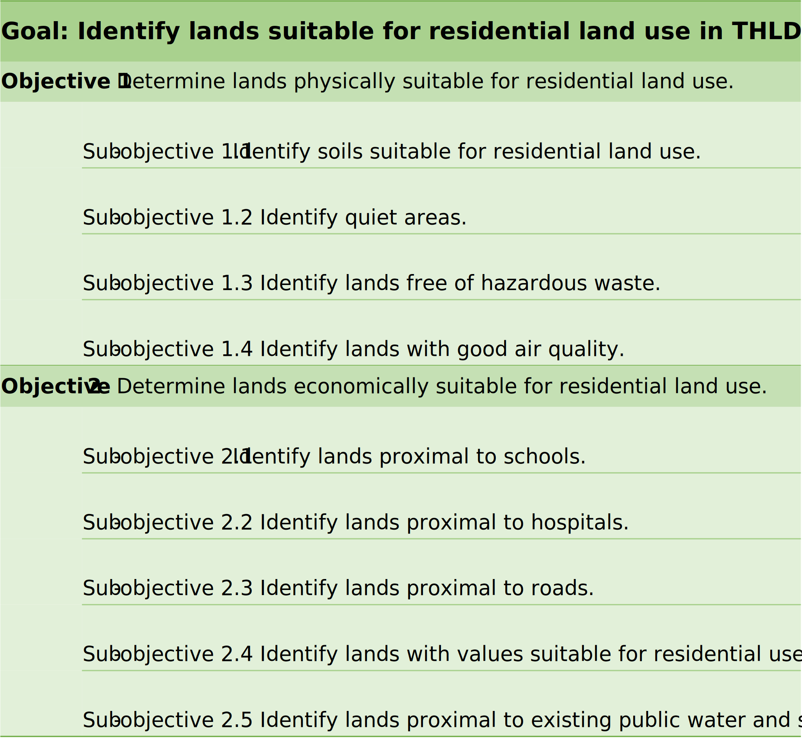
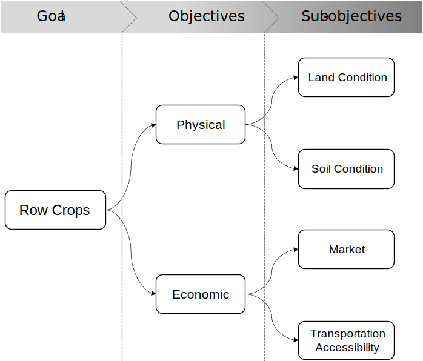

# Module 4 - Making Land-Use Decisions using the LUCIS Framework

**What will you learn from this module?**

- Understand the framework of LUCIS,
- Get to know the AHP,
- Learn more weights assignment methods in land-use decisions.

## 1. The LUCIS Philosophy

In the planning process, when planners make land-use decisions, the common
problem is the **land-use conflicts** caused by the different values and
motivations of the stakeholder groups that represent the interests of the
three land-use categories.

To solve the **land-use conflict** problem, planners will refer to
the **Land-Use Conflict Identification Strategy** (LUCIS) which is a
***goal-driven*** GIS model that produces a <ins>spatial representation</ins>
of **probable patterns** of future land use. The following diagram shows
the general process of the LUCIS Framework.

### The general workflow of LUCIS

1. [Define goals, objectives, and sub-objectives]()
2. [Define sub-objectives](https://tinyurl.com/2jptepna)
3. Dataset Preparation
4. [Suitability Modeling]()
5. [Analytic Hierarchy Process (AHP)]()

This module will introduce **Define Goals and Objectives and Sub-objectives**
and **Analytic Hierarchy Process (AHP)**. Dataset preparation will not be
elaborated in this module, and recall that the suitability modeling has been
introduced in [Module 3]().  

### 1.1 Define Goals, Objectives and Sub-objectives

As shown in the figure above, **Goals**, **Objectives** and **Sub-objectives**
are a hierarchical set of statements, they are defined in LUCIS as follows:

1. Goals: describe what is to be accomplished;
2. Objectives: describe how each accomplishment is to be achieved;
3. Sub-objectives: supporting statements for goals and objectives.

#### 1.1.1 Goal

In the LUCIS Framework, the first step is to define the **goals** of the
project. Three categories are employed to find the goal: 1) *agricultural
productions*, 2) *socioeconomic activities*, and 3) *ecological functions*.
To define a goal, we need to:

1. Inquire the intents of stakeholders;
2. Sort out the intents into agricultural productions, socioeconomic
   activities, and ecological functions.

Specifically, these three categories will be turned into three land uses
categories correspondingly: 1) **agricultural land uses**,
2) **urban land uses**, and 3) **conservational land use**. In other words,
we will make sure our goal fall into these three land-use categories (e.g.,
to develop commercial land use for emerging industries in a city).

In real world setting, a broad range of time and effort is normally devoted
to the development of goals, but it is well worth to spend time on defining
explicit goals.

#### 1.1.2 Objective

After we have goals, we need to develop the objectives for each goal. As
described by its definition, objectives are set to describe how each goal is
to be achieved. Since three land uses categories are used in LUCIS, we use
different objectives for each land use category.

For **agricultural** and **urban land uses**, we always consider two
objectives:

- Physical suitability
- Economic suitability

In terms of conservational land, we consider the significance of conservational
land and two objectives are commonly used:

- Existing ecological value
- Potential ecological value

#### 1.1.3 Sub-objective

Generally, sub-objectives are a group of statements that can help to
evaluate the objective. Note that **not** all objectives are required to
have sub-objectives if the objective is self-evident.

### 1.2 Example

In this section, we will use an example of THLD area to illustrate the
workflow of defining **Goals**, **Objectives** and **Sub-objectives** in LUCIS.

#### 1.1.1 Define Goals

As a planner, first we need to ask the intents of stakeholders. Let's say one
intent of the stakeholders is to <ins>***develop a land-use scenarios for THLD
area to accommodate the population projected for the year 2050***</ins>.

We can distill some goals from this intent according to the three
categories: 1) *agricultural productions*, 2) *socioeconomic activities*,
and 3) *ecological functions*.

| Categories               | Land use categories              | Possible goal                                                                     |
| ------------------------ | ---------------------- | --------------------------------------------------------------------------------- |
| Agricultural productions | Agricultural land uses | Increase the food production for future population growth                         |
| Socioeconomic activities | Urban land uses        | Develop more residential land uses in THLD area to solve the future housing issue |
| Ecological functions     | Conservational land    | Protect conservational land                                                       |

#### 1.2.2 Define Objectives and sub

We use the goal in *Socioeconomic activities*, which is **Develop more
residential land uses in THLD area to solve the future population growth**, as
an example. The possible objectives and sub-objectives are represented in the
following chart:

We want to develop objectives for the residential land use goal to accommodate
the future population growth. Considering the physical suitability aspect,
we have four sub-objectives. For the economic objective, we have five
sub-objectives.

## 2. AHP

## 3. Row Crops Models

Each IDU in the THLD area will be assigned to one of the four land uses by
comparing land use scores: Row Crops, Livestock, Timberland, and Urban.

In Row Crops model, we evaluate the IDUs' suitability in growing Row Crops based
on two objectives: physical suitability and economic suitability.
The following figure shows the Row Crops model.

In terms of physical suitability, we look for conditions in which land
growing Row Crops can have the optimized production.
In this objectives, we consider [_Land Condition_](https://github.com/SERVIR-WA/GALUP/wiki/models_ag#land-condition-physical)
and [_Soil Condition_](https://github.com/SERVIR-WA/GALUP/wiki/models_ag#soil-condition-physical)
as important criteria to determine how many IDUs in THLD district are physically
suitable to grow Row Crops.

In terms of economic suitability, we evaluate the economic efficiency of each IDU
in THLD district.
We expect the land owners who grow Row Crops spend the lowest cost on transportation.
Therefore, we need to ensure lands growing Row Crops have shorter distance to
primary/secondary roads and small/middle/large cities than those without growing
Row Crops.
To achieve that, we choose
[_Transport Accessibility_](https://github.com/SERVIR-WA/GALUP/wiki/models_ag#transport-accessibility-economic)
and [_Market_](https://github.com/SERVIR-WA/GALUP/wiki/models_ag#market-economic)
as criteria to evaluate how many IDUs in THLD district are economically suitable.

The intent of the row crops model is to identify lands most suitable for growing row crops.
The suitability of the land to grow row crops depends on two aspects: whether this land has relatively appropriate physical conditions to optimize the production; and how much development or transportation costs it can save compared with others.
Therefore, this model set up two objectives, physical suitability and economic suitability, for measuring the success of choosing a suitable land.
The following figure shows the Row Crops model.

In terms of physical suitability, we look for conditions in which land
growing Row Crops can have the optimized production.
In this objectives, we consider [_Landscape Condition_](https://github.com/SERVIR-WA/GALUP/wiki/models_ag#land-condition-physical)
and [_Soil Condition_](https://github.com/SERVIR-WA/GALUP/wiki/models_ag#soil-condition-physical)
as important criteria to determine how many IDUs in THLD district are physically
suitable to grow Row Crops.

In terms of economic suitability, we evaluate the economic efficiency of each IDU
in THLD district.
We expect the land owners who grow Row Crops spend the lowest cost on transportation.
Therefore, we need to ensure lands growing Row Crops have shorter distance to
primary/secondary roads and small/middle/large cities than those without growing
Row Crops.
To achieve that, we choose
[_Transport Accessibility_](https://github.com/SERVIR-WA/GALUP/wiki/models_ag#transport-accessibility-economic)
and [_Market_](https://github.com/SERVIR-WA/GALUP/wiki/models_ag#market-economic)
as criteria to evaluate how many IDUs in THLD district are economically suitable.

## 4. Weighting Method
