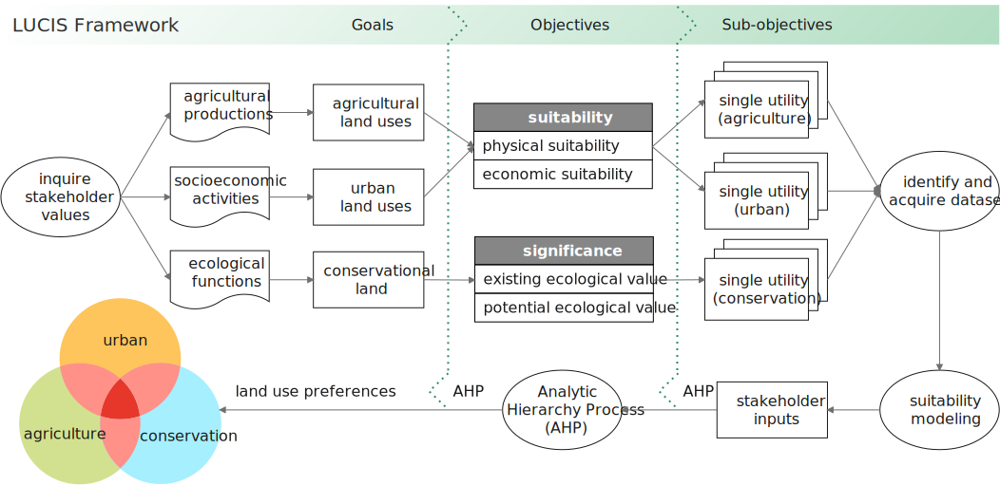

### 1.1 The LUCIS Philosophy

The **Land-Use Conflict Identification Strategy** (LUCIS) is a
***goal-driven*** GIS model that produces a <ins>spatial representation</ins>
of **probable patterns** of future land use.
The following diagram shows the general process of the LUCIS Framework.

#### 1.1.1 Goals

In the LUCIS Framework, the first step is to ascertain the **goals** of .
We need to inquire the opinions of stakeholders and separate these values into
three categories: 1) agricultural productions, 2) socioeconomic activities, and
1) ecological functions.
To be more specific, these three categories can be turned into three land uses
correspondingly: 1) agricultural land uses, 2) urban land uses, and
3) conservational land.
Therefore, the goals are to identify land use for agricultural land uses, urban
land uses, and conservational land.

#### 1.1.2 Objectives

The second step is to ascertain the objectives for each goal. For agricultural land uses and urban land uses, we always consider the suitability, in which two perspectives are commonly used to derive objectives: 1) physical suitability, and 2) economic suitability. In terms of conservational land, we consider the significance of conservational land and two perspectives are commonly used: 1) existing ecological value, and 2) potential ecological value.

#### 1.1.3 Sub-objectives

In this last step, sub-objectives is the specified objectives. For example, if the the objective is to consider the physical suitability perspective (objective) of the residential land use (a goal in urban land uses), one of the sub-objectives can be that to evaluate the proximity of research areas to educational facilities.