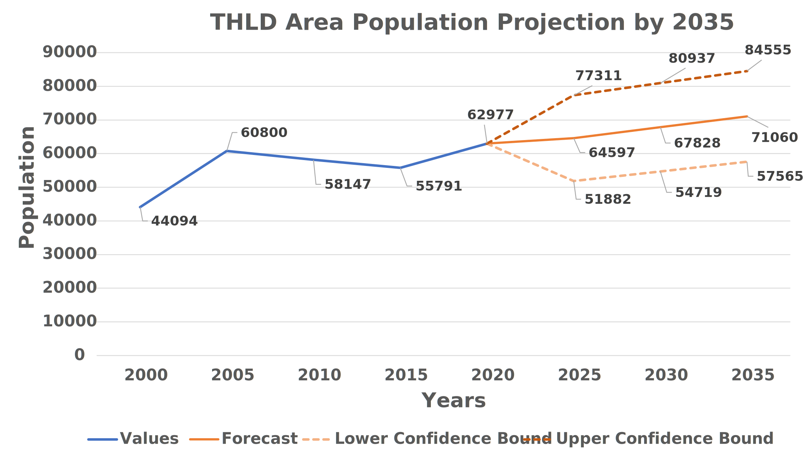
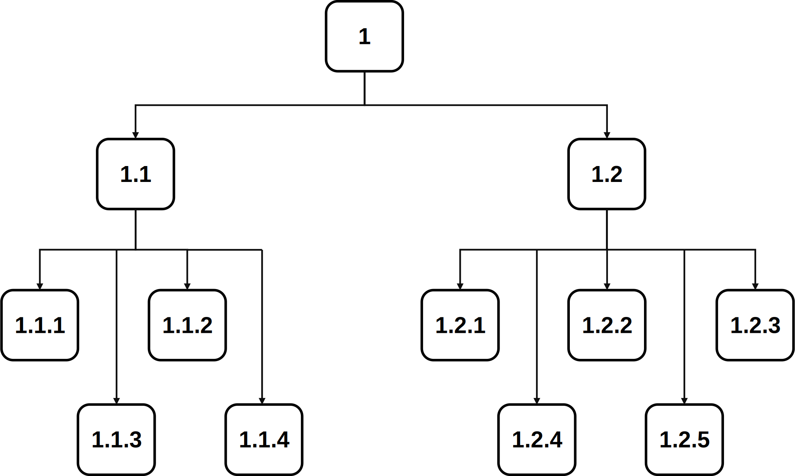
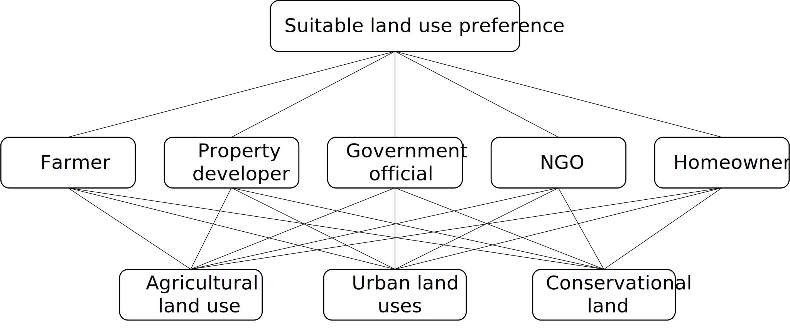

# Module 4 - Making Land-Use Decisions using the LUCIS Framework

Table of Contents

- [Module 4 - Making Land-Use Decisions using the LUCIS Framework](#module-4---making-land-use-decisions-using-the-lucis-framework)
  - [1. The LUCIS Philosophy](#1-the-lucis-philosophy)
    - [1.1 The LUCIS workflow](#11-the-lucis-workflow)
    - [1.2 An example of the hierarchical structure of LUCIS](#12-an-example-of-the-hierarchical-structure-of-lucis)
      - [1.2.2 Define Objectives and Sub-objectives](#122-define-objectives-and-sub-objectives)
  - [2. Analytic Hierarchy Process](#2-analytic-hierarchy-process)
  - [3. Exercise](#3-exercise)

## 1. The LUCIS Philosophy

When making land-use decisions in a planning process, a common situation faced
by planners is the **land-use conflicts** arisen from the different values and
motivations of the stakeholder groups who are interested in one of the three
broad land-use categories: (1) **_agricultural_** land uses, (2) **_urban_**
land uses, and (3) **_conservation_** land.
The **Land-Use Conflict Identification Strategy** (LUCIS) is a
_goal-driven GIS model_ based on the theories of suitability analysis
introduced in [Module 3](module3.md).
LUCIS aims at producing a _spatial representation_ of
<ins>probable patterns</ins> of future land-use scenario by identifying
conflicts in different land-use categories and carefully addressing them.

### 1.1 The LUCIS workflow

The diagram below shows the general process of the LUCIS Framework.

:small_blue_diamond: First, planners meet with the _stakeholders_ of the
project and ask them about their **values** and **opinions**.
As mentioned before, the stakeholders here are <ins>groups of people</ins>
whose interests fall into one of the three land-use categories, i.e.,
_agriculture_, _conservation_, and _urban space_.
For example, agricultural stakeholders might include members of the local
farm bureau or a cattlemen and ranchers group.
Urban development stakeholders might include representatives of the
homebuilders and real estate associations.
Conservation interests might be represented by members of locally active
conservation organizations, or non-governmental organization (NGO).

:small_blue_diamond: Second, the _values_ and _interests_ are carefully sorted
to develop a **_three-tire hierarchical structure_** formed by _goals_,
_objectives_, and _sub-objectives_.

1. <ins>Goals</ins> are directly distilled from the stakeholders' interests in
   three general purposes—_agricultural productions_,
   _socioeconomic activities_, and _ecological functions_—which, in turn,
   correspond to the three broad land-use categories: **_agricultural_** land
   uses, **_urban_** land uses, and **_conservational_** land.
2. <ins>Objectives</ins> are defined to help accomplish individual goals.
   - For **_agricultural_** and **_urban_** land uses, we usually conceptualize
     objectives through two perspectives:
      - Physical suitability
      - Economic suitability
   - For **_conservation_** land, we focus on the ecological significance of
     the land from two aspects:
      - Existing ecological value
      - Potential ecological value
3. <ins>Sub-objectives</ins> are a group of statements that can help assess
   their respective _objectives_, which are the base analytical units of the
   LUCIS framework.
   The modeling of sub-objective is referred to as
   **_Single Utility Assignment_** (SUA), the assignment of utility values for
   individual features in a single layer of spatial data.
   Here, _utility values_ are the units by which suitability is measured, i.e.,
   a value ranged from 1 to 9 indicating lowest to highest suitability.

:small_blue_diamond: Then, dataset preparation will be conducted according to
the data requirements for modeling **sub-objectives**.

:small_blue_diamond: The **Analytic Hierarchy Process** (AHP), a Multi-Criteria
Decision Making (MCDM) algorithm, is chosen by LUCIS to merge results from the
bottom to the top of the hierarchical structure of LUCIS.

:small_blue_diamond: Finally, after deriving the overall suitability for urban,
agriculture, and conservation, the suitability values are transformed into
**preferences**.`
Each land unit will have a specific combination of the collapsed preference
values, _1_ (low), _2_ (medium), and _3_ (high), which are used to identify
area of potential land-use conflicts.

### 1.2 An example of the hierarchical structure of LUCIS

This section presents a concrete example of LUCIS's hierarchical structure,
i.e., **goals**, **objectives** and **sub-objectives**.

As a planner, first we need to ask the intents of stakeholders.
Let's say one intent of the stakeholders is to <ins>***develop a land-use
scenarios for THLD area to accommodate the population projected for the year
2035***</ins>.

> Rose, A. N., McKee, J. J., Sims, K. M., Bright, E. A., Reith, A. E., & Urban,
> M. L. (2020). _LandScan 2019_. Oak Ridge National Laboratory.
> https://landscan.ornl.gov/

We can distill a goal from this intent for *socioeconomic activities*. As
shown in the THLD Area Population Projection by 2035 chart above, the two
dotted lines are two scenarios representing the upper limit and lower limit of
the population projection by 2035 respectively. The middle solid line is
the general scenario which indicates that there would be 71,060 people in THLD
area.
Therefore, one possible goal is to **develop more residential land uses in THLD
area to solve the future housing issue**.

| Categories              | Land use categories     | Possible goal                                                                      |
| ----------------------- | ----------------------- | ---------------------------------------------------------------------------------- |
| Socioeconomic activities | Urban land uses | Develop more residential land uses in THLD area to solve the future housing issue. |

#### 1.2.2 Define Objectives and Sub-objectives

We use the goal in *Socioeconomic activities*, which is **Develop more
residential land uses in THLD area to solve the future housing issue**, as
an example. The possible objectives and sub-objectives are represented in the
following chart and the hierarchy relationship between goal, objectives and
sub-objectives is denoted by the following map:

|  Goal, Objectives, Sub-objectives |    Hierarchy Map   |
|:---------------------------------:|:------------------:|
|  |  |

> :bulb: Note: 
> The goal, objectives, and sub-objectives are denoted by the numbers in the
> hierarchy map.

We want to develop objectives for the residential land use goal to accommodate
the future population growth. Considering the physical suitability aspect,
we have four sub-objectives. For the economic objective, we have five
sub-objectives.

## 2. Analytic Hierarchy Process

The [Analytic Hierarchy Process](https://tinyurl.com/4bs2xxmm) (AHP) is a
structured technique for organizing and analyzing complex decisions.
AHP is a widely applied method for Multi-Criteria Decision Making (MCDM)
problems.
It is based on solving an [eigenvalue equation](https://tinyurl.com/e3s5xxuy):
,
where **_A_** is a _reciprocal matrix_ formed by pairwise comparisons.

Without going too far on the mathematical details of AHP, the rest of this
section presents an example of how AHP can be used in making land-use
decisions.
**Imagine** that five stakeholders were asked about their personal opinions
towards the three broad land-use categories.
These stakeholders include a farmer, a property developer, a government
official, a representative of a non-governmental organization (NGO), and a
homeowner.
The decision-making intends to decide the preference of three land-use types:
_agricultural_ land uses, _urban_ land uses, and _conservational_ land.

The first step of AHP is to structure the intention as a hierarchy.
In the first level is the overall goal of land-use preferences.
In the second level are the five stakeholders who have interests in
land development, and the third level are the three land use types which are
to be evaluated by each stakeholders in the second level.

The second step is the elicitation of pairwise comparison judgments.
The elements to be compared are the different land-use types
for which one is more important in future land development according to
each stakeholder in level 2.
The scale to use in making the judgments is given in the following table.

> Saaty, T. L. (1990).
> _How to make a decision: The analytic hierarchy process_.
> European Journal of Operational Research, 48(1), 9-26.
> https://doi.org/10.1016/0377-2217(90)90057-I

Land-use types are compared on a scale from 1 (equally important) to 9
(extremely important).
Thus there will be five 3 X 3 matrices of judgments since there are
five elements in level 2, and 3 land-use types to be pairwise compared
for each element.
Then, the pairwise values (1–9) are entered in the cells of five matrices.

> :bulb: **Why judgments are given in the form of paired comparisons** 
> The most effective way to concentrate judgment is to take a pair of
> elements and compare them on a single property without concern for other
> properties or other elements.
> This is why paired comparisons in combination with the hierarchical structure
> are useful in deriving measurement.

To understand the judgments, a brief description of each stakeholder's
interests are shown below:

1. The **farmer** wants to protect farmers' interests in the district to have
   enough agricultural land for future development.
2. The **property developer** wants to optimize developers' interests during
   the process of developing the district that he wish urban land could
   occupy the most of area in the district.
3. The **government official** wishes to develop more urban land in the future,
   whereas the straitened financial circumstances do not allow government to
   sustain too many urban infrastructure facilities.
4. The **NGO**'s representative has focused on forest conservation in this
   district for many years, and NGO wishes the conservation land could cover
   more closed forests.
5. The **homeowner** wants to have more convenient transportation and better
   living condition.
   However, he also indicates that agricultural land is equally important as
   urban land since many residents are taking agricultural production for
   a living.

Therefore, the five stakeholders would like to assign land-use suitability for
each purpose as follows:

After constructing the matrices,
[Compute AHP Weights](https://github.com/SERVIR-WA/GALUP/wiki/Tools#compute-ahp-weights)
in LUCIS-OPEN tools will be used to calculate local priorities for each matrix.

The third step is to establish the global priorities of the suitable land use
preference.
In this case, opinions from each stakeholder are viewed as equally important.
When arranging the elements in the second level into a matrix and comparing
them one by one for the relative importance of the elements concerning the
overall goal, each of the five stakeholders will receive the same priority of
20%.

The table lays out the local priorities of land-use types with respect to
each stakeholder in a matrix and multiply each column of vectors by
the priority of the corresponding stakeholder and add across each row
which results in the desired vector of land-use importance in the table.
In this case, urban land uses are the most favorable type in this district.
Agricultural land use was less desirable than urban land use, and Conservation
land was the least important in the three land-use types.

 

## 3. Exercise

- Exercise 1： Please replicate the AHP calculations discussed in
  [Section 2](#2-analytic-hierarchy-process).
  Use the **_Compute AHP Weights_** tool to solve the five matrices.
  Create an Excel file to store the results of each (local) priority vector.
  Calculate the final priority vector, and submit the Excel file.
