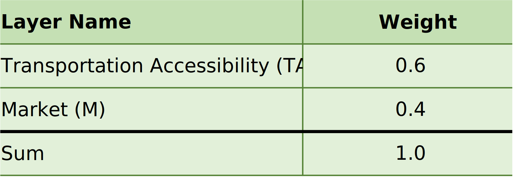
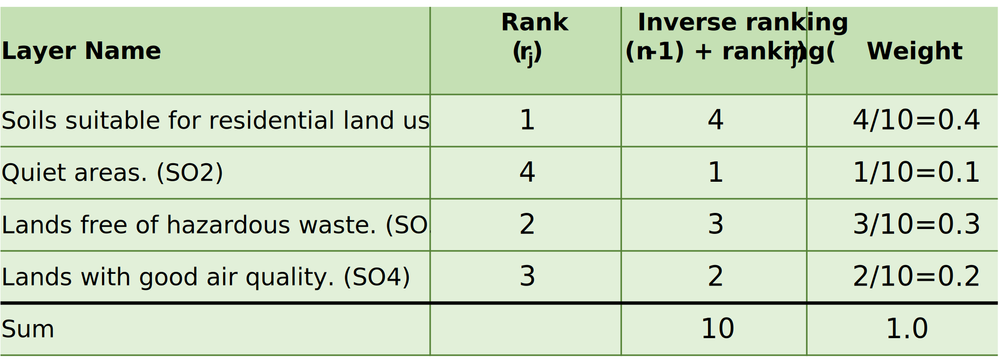
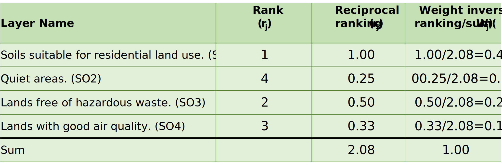
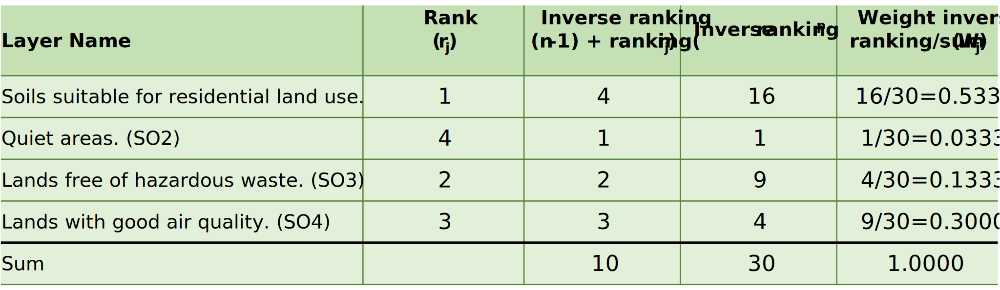

# Module 4 - Making Land-Use Decisions using the LUCIS Framework

- [Module 4 - Making Land-Use Decisions using the LUCIS Framework](#module-4---making-land-use-decisions-using-the-lucis-framework)
  - [1. The LUCIS Philosophy](#1-the-lucis-philosophy)
    - [1.1 The LUCIS workflow](#11-the-lucis-workflow)
    - [1.2 An example of the hierarchical structure of LUCIS](#12-an-example-of-the-hierarchical-structure-of-lucis)
  - [2. Analytic Hierarchy Process](#2-analytic-hierarchy-process)
  - [3. How the Row Crops Models fit into LUCIS](#3-how-the-row-crops-models-fit-into-lucis)
    - [3.1 The structure of the row crops goal](#31-the-structure-of-the-row-crops-goal)
    - [3.2 The bottom-up strategy to obtain the final suitability](#32-the-bottom-up-strategy-to-obtain-the-final-suitability)
  - [4. Weighting Methods for MUA](#4-weighting-methods-for-mua)
    - [4.1 Applying preference or expert knowledge](#41-applying-preference-or-expert-knowledge)
    - [4.2 The rank sum method](#42-the-rank-sum-method)
    - [4.3 The rank reciprocal method](#43-the-rank-reciprocal-method)
    - [4.4 The rank exponential method](#44-the-rank-exponential-method)
    - [4.5 Weights generated by AHP](#45-weights-generated-by-ahp)
  - [5. Exercises and Surveys](#5-exercises-and-surveys)

## 1. The LUCIS Philosophy

When making land-use decisions in a planning process, a common situation faced
by planners is the **land-use conflicts** arisen from the different values and
motivations of the stakeholder groups who are interested in one of the three
broad land-use categories: (1) **_agricultural_** land uses, (2) **_urban_**
land uses, and (3) **_conservation_** land.
The **Land-Use Conflict Identification Strategy** (LUCIS) is a
_goal-driven GIS model_ based on the theories of suitability analysis
introduced in [Module 3](module3.md).
LUCIS aims at producing a _spatial representation_ of
<ins>probable patterns</ins> of future land-use scenario by identifying
conflicts in different land-use categories and carefully addressing them.

### 1.1 The LUCIS workflow

The diagram below shows the general process of the LUCIS Framework.

:small_blue_diamond: First, planners meet with the _stakeholders_ of the
project and ask them about their **values** and **opinions**.
As mentioned before, the stakeholders here are <ins>groups of people</ins>
whose interests fall into one of the three land-use categories, i.e.,
_agriculture_, _conservation_, and _urban space_.
For example, agricultural stakeholders might include members of the local
farm bureau or a cattlemen and ranchers group.
Urban development stakeholders might include representatives of the
homebuilders and real estate associations.
Conservation interests might be represented by members of locally active
conservation organizations, or non-governmental organization (NGO).

:small_blue_diamond: Second, the _values_ and _interests_ are carefully sorted
to develop a **_three-tire hierarchical structure_** formed by _goals_,
_objectives_, and _sub-objectives_.

1. <ins>Goals</ins> are directly distilled from the stakeholders' interests in
   three general purposes—_agricultural productions_,
   _socioeconomic activities_, and _ecological functions_—which, in turn,
   correspond to the three broad land-use categories: **_agricultural_** land
   uses, **_urban_** land uses, and **_conservational_** land.
2. <ins>Objectives</ins> are defined to help accomplish individual goals.
   - For **_agricultural_** and **_urban_** land uses, we usually conceptualize
     objectives through two perspectives:
      - Physical suitability
      - Economic suitability
   - For **_conservation_** land, we focus on the ecological significance of
     the land from two aspects:
      - Existing ecological value
      - Potential ecological value
3. <ins>Sub-objectives</ins> are a group of statements that can help assess
   their respective _objectives_, which are the base analytical units of the
   LUCIS framework.
   The modeling of sub-objective is referred to as
   **_Single Utility Assignment_** (SUA), the assignment of utility values for
   individual features in a single layer of spatial data.
   Here, _utility values_ are the units by which suitability is measured, i.e.,
   a value ranged from 1 to 9 indicating lowest to highest suitability.

:small_blue_diamond: Then, dataset preparation will be conducted according to
the data requirements for modeling **sub-objectives**.

:small_blue_diamond: The **Analytic Hierarchy Process** (AHP), a Multi-Criteria
Decision Making (MCDM) algorithm, is chosen by LUCIS to merge results from the
bottom to the top of the hierarchical structure of LUCIS.

:small_blue_diamond: Finally, after deriving the overall suitability for urban,
agriculture, and conservation, the suitability values are transformed into
**preferences**.`
Each land unit will have a specific combination of the collapsed preference
values, _1_ (low), _2_ (medium), and _3_ (high), which are used to identify
area of potential land-use conflicts.

### 1.2 An example of the hierarchical structure of LUCIS

This section presents a concrete example of LUCIS's hierarchical structure,
i.e., **goals**, **objectives** and **sub-objectives**.
The most critical component of a land-use plan is that it must
<ins>accommodate the projected population growth</ins>.
In this example, we will use the THLD District Assembly and look at the
projected population in year 2035.

> Rose, A. N., McKee, J. J., Sims, K. M., Bright, E. A., Reith, A. E., & Urban,
> M. L. (2020). _LandScan 2019_. Oak Ridge National Laboratory.
> https://landscan.ornl.gov/

We can distill a **goal** from this intent for *socioeconomic activities*.
As shown in the THLD Area Population Projection by 2035 chart above, the two
dotted lines are two scenarios representing the upper and lower
_confidence interval_ of the population projection by 2035.
The middle solid line is the general scenario which indicates that there would
be 71,060 people in THLD area.
Therefore, the goal is to develop more residential land uses in the
THLD area to _address the housing demands_.

The **objectives** and **sub-objectives** are specified in the following table
and the hierarchy relationship between goal, objectives and sub-objectives is
shown by the following diagram:

|  Goal, Objectives, Sub-objectives |    Hierarchy Diagram   |
|:---------------------------------:|:------------------:|
|  |  |

> :bulb: Note: 
> The goal, objectives, and sub-objectives are denoted by the numbers in the
> hierarchy map.

We want to develop objectives for the residential land use goal to accommodate
the future population growth.
Considering the physical suitability aspect, we have four _sub-objectives_.
For the economic objective, we have five _sub-objectives_.

## 2. Analytic Hierarchy Process

The [Analytic Hierarchy Process](https://tinyurl.com/4bs2xxmm) (AHP) is a
structured technique for organizing and analyzing complex decisions.
AHP is a widely applied method for Multi-Criteria Decision Making (MCDM)
problems.
It is based on solving an [eigenvalue equation](https://tinyurl.com/e3s5xxuy):
,
where **_A_** is a _reciprocal matrix_ formed by pairwise comparisons.

Without going too far on the mathematical details of AHP, the rest of this
section presents an example of how AHP can be used in making land-use
decisions.
**Imagine** that five stakeholders were asked about their personal opinions
towards the three broad land-use categories.
These stakeholders include a farmer, a property developer, a government
official, a representative of a non-governmental organization (NGO), and a
homeowner.
The decision-making intends to decide the preference of three land-use types:
_agricultural_ land uses, _urban_ land uses, and _conservational_ land.

The first step of AHP is to structure the intention as a hierarchy.
In the first level is the overall goal of land-use preferences.
In the second level are the five stakeholders who have interests in
land development, and the third level are the three land use types which are
to be evaluated by each stakeholders in the second level.

The second step is the elicitation of pairwise comparison judgments.
The elements to be compared are the different land-use types
for which one is more important in future land development according to
each stakeholder in level 2.
The scale to use in making the judgments is given in the following table.

> Saaty, T. L. (1990).
> _How to make a decision: The analytic hierarchy process_.
> European Journal of Operational Research, 48(1), 9-26.
> https://doi.org/10.1016/0377-2217(90)90057-I

Land-use types are compared on a scale from 1 (equally important) to 9
(extremely important).
Thus there will be five 3 X 3 matrices of judgments since there are
five elements in level 2, and 3 land-use types to be pairwise compared
for each element.
Then, the pairwise values (1–9) are entered in the cells of five matrices.

> :bulb: **Why judgments are given in the form of paired comparisons** 
> The most effective way to concentrate judgment is to take a pair of
> elements and compare them on a single property without concern for other
> properties or other elements.
> This is why paired comparisons in combination with the hierarchical structure
> are useful in deriving measurement.

To understand the judgments, a brief description of each stakeholder's
interests are shown below:

1. The **farmer** wants to protect farmers' interests in the district to have
   enough agricultural land for future development.
2. The **property developer** wants to optimize developers' interests during
   the process of developing the district that he wish urban land could
   occupy the most of area in the district.
3. The **government official** wishes to develop more urban land in the future,
   whereas the straitened financial circumstances do not allow government to
   sustain too many urban infrastructure facilities.
4. The **NGO**'s representative has focused on forest conservation in this
   district for many years, and NGO wishes the conservation land could cover
   more closed forests.
5. The **homeowner** wants to have more convenient transportation and better
   living condition.
   However, he also indicates that agricultural land is equally important as
   urban land since many residents are taking agricultural production for
   a living.

Therefore, the five stakeholders would like to assign land-use suitability for
each purpose as follows:

After constructing the matrices,
[Compute AHP Weights](https://github.com/SERVIR-WA/GALUP/wiki/Tools#compute-ahp-weights)
in OPEN-LUCIS tools will be used to calculate local priorities for each matrix.

The third step is to establish the global priorities of the suitable land use
preference.
In this case, opinions from each stakeholder are viewed as equally important.
When arranging the elements in the second level into a matrix and comparing
them one by one for the relative importance of the elements concerning the
overall goal, each of the five stakeholders will receive the same priority of
20%.

The table lays out the local priorities of land-use types with respect to
each stakeholder in a matrix and multiply each column of vectors by
the priority of the corresponding stakeholder and add across each row
which results in the desired vector of land-use importance in the table.
In this case, urban land uses are the most favorable type in this district.
Agricultural land use was less desirable than urban land use, and Conservation
land was the least important in the three land-use types.

## 3. How the Row Crops Models fit into LUCIS

### 3.1 The structure of the row crops goal

Recall, in Module 3, we have created four models to analyze
**Crop Farming Suitability** including (1) _landscape condition_,
(2) _soil condition_, (3) _market proximity_, and
(4) _transport accessibility_.
These models are in fact integral components of the LUCIS's hierarchical
structure.
Together, they constitute the Crop Farming goal, one of the goals under the
agricultural land uses.
The following diagram reflects the models are organized to form the 3-tier
hierarchy of LUCIS.

The crop farming **goal** consists of two **objectives**,
(1)_physical suitability_ and (2) _economic suitability_, the same as described
before in [Section 1.1](#11-the-lucis-workflow).
From the **physical** perspective, we assess suitability for crop
production based on the attributes (or conditions) that is native to the land.
Thus, [Landscape Condition](https://tinyurl.com/3tysra42) and
[Soil Condition](https://tinyurl.com/swvpj3pv) are under the first objective.
From an **economic** stand point, we evaluate suitability for growing row crops
based on the _cost-effectiveness_ of distributing them from a given IDU.
Therefore, we developed
[_Transport Accessibility_](https://tinyurl.com/2c6prn2m) and
[_Market Proximity_](https://tinyurl.com/jxuptxmn) models as sub-objectives of
the second objective.

### 3.2 The bottom-up strategy to obtain the final suitability

The most intuitive approach to combine results of individual sub-objectives is
by assigning weights.

> :bulb: **Why a middle tier of objectives is needed**? 
> In [Section 1.1](#11-the-lucis-workflow), we mentioned that the process of
> modeling sub-objective is called _single utility assignment_, or SUA.
> Modeling an objective often requires to evaluate more than a single factor.
> Therefore, correspondingly, such process is referred to as
> **Multiple Utility Assignment** (MUA).
> But, it is critical to make sure that a MUA maintains a **_cohesive_**
> subject by itself, and its components are **_coherent_** and all contribute
> to that subject.
> For example, if we don't create a middle tier for objectives under the row
> crops goals, mixing the four sub-objectives makes little sense conceptually
> and operationally.
> In other words, it is logical to assign weights between market proximity and
> transport accessibility since they are both proximity related.
> But, it would seem wrong, like comparing an apple with an orange, to assign
> weights between soil condition and market proximity as they are measuring two
> totally different things.

The logic explained above set the rules for how to combine from sub-objectives
to objectives and to goals.
In a nutshell, the process is a series of "Weighted Sum" starting from the
bottom tier (sub-objectives) to the middle tier (objectives), and to the
top tier (goals).
Note that, different branch cannot be mixed.
They can only be combined when their branches merged.
For example, we can use the following weights to get the final suitability of
row crops.

1. Under economic suitability, add _market proximity_ and
   _transport accessibility_ by using a 30% and 70% weight, respectively.
2. Under physical suitability, add _soil condition_ and _landscape condition_
   with 60% and 40% weights, respectively.
3. Finally, after getting physical and economic suitability, the two objectives
   gets added with a 70% and 30% weight, respectively.

The final suitability according to the above weights is shown below:

## 4. Weighting Methods for MUA

As mentioned above, the combination of multiple SUA layers is called
_Multiple utility Assignment_ (MUA).
The MUA assignment process is often referred to as weighted overlay, which, as
the name implies, combines layers using _weights_ or _percentage of influence_.
A couple of weighting methods are presented below.
In the exercises, we will see how we can apply various methods to combine
results from individual SUAs.

### 4.1 Applying preference or expert knowledge

The naïve approach for determining weights is based on preference or expert
knowledge.
For example, in the objective of _economic suitability_, one may want to
assign a higher weight to transport accessibility than market proximity since
nowadays accessibility to transportation networks is more vital than closeness
to the markets as most of the cultivated crops are not sold locally or even
within the region.

 

### 4.2 The rank sum method

The rank sum method is a simple method to assign weights by arranging the
criteria (layers) in rank order where the value 1 signifies most important,
2 next important, and so on, to the nth important criteria.
Next, subtract each layer’s ranking from the total number of layers and add 1
to produce the inverse rank value.
Finally, divide each of the layer’s inverse rank value by the sum of the
inverse rankings for all layers to produce the weight value for each layer.

   

### 4.3 The rank reciprocal method

This method of developing weights requires the modeler to reciprocate
each layer value, then divide the individual reciprocal values by the sum of
all reciprocal values.

   

 

### 4.4 The rank exponential method

The rank exponential method uses essentially the same methodology as the rank
sum method, but allows the modeler to exponentially raise the individual
ranking values, which separates the weighted values farther apart than either
the rank sum or rank reciprocal methods.
Each individual ranking value is then divided by the sum of all the exponential
values.

   

 

Comparison of the three ranking methods described here indicates that the
_rank sum_ method tends to keep the criteria weightings closer together, or
more **_clustered_**, than the other methods, while the _rank exponential_
method **_exaggerates the extreme_** criteria more than the rank sum or
_rank reciprocal_.

> Malczewski, J. (1999).
> GIS and multicriteria decision analysis. New York: John Wiley & Sons, Inc.

### 4.5 Weights generated by AHP

As introduced before, AHP is a weighting method based on pairwise comparisons.
Compared to other weighting methods mentioned above, AHP is more mathematically
involved and sophisticated.
In LUCIS, it is usually used in determining weights for different goals, which
we will see in Exercise 2.
Also, please note for AHP to work mathematically, there has to be at least
**3** criteria participating in the pairwise comparisons.
Such minimum number requirement stops the use of AHP in certain scenarios.
For example, in the row crop model described in
[Section 3](#3-how-the-row-crops-models-fit-into-lucis), AHP is not applicable
for determining weights between the two sub-objectives under either objectives.

## 5. Exercises and Surveys

- Exercise 1：Please replicate the AHP calculations discussed in
  [Section 2](#2-analytic-hierarchy-process).
  Use the **_Compute AHP Weights_** tool to solve the five matrices.
  Please create an Excel file to store the results of each (local) priority
  vector.
  Calculate the final **_priority vector_**, and submit the Excel file.
- Please complete [exercise 2](../exercises/m4_exercise2.md).
- Please complete [exercise 3](../exercises/m4_exercise3.md).
- Please submit your exercises [here](https://tinyurl.com/427mtu9t).
- Please complete the survey for Module 4 [here](https://tinyurl.com/c7my5fym).
- Please complete the post-training survey for your overall experiences with
  the first GALUP workshop—Land-Use Suitability Analysis with QGIS Tools at
  [here](https://tinyurl.com/2m6cm4e8).
