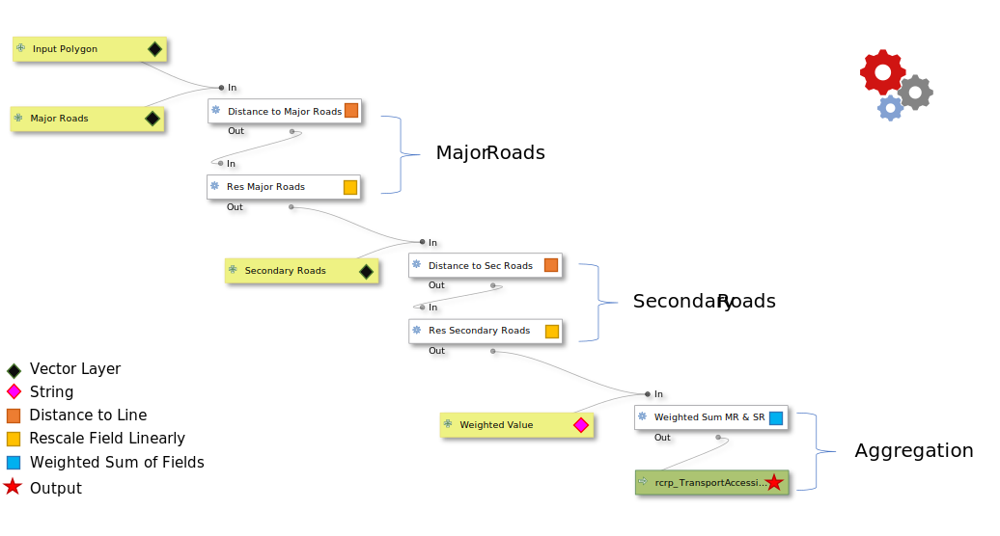
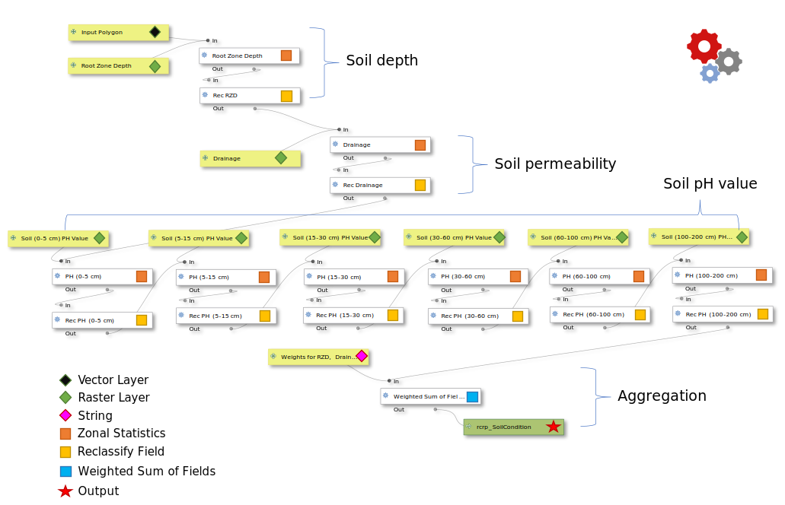

# Module 3 - Create Suitability Models with QGIS Graphical Modeler

**What will you learn from this module?**

- Understand the general workflow of suitability modeling,
- Get to know the QGIS **Graphical Modeler**,
- Learn how to build suitability models with OPEN-LUCIS tools for QGIS in the
  Graphical Modeler,
- Learn the details and the logic behind the suitability models for
  ***Row Crops***.

## 1. Land-use Suitability Modeling</a>

**Suitability** is a measure of the *relative degree* to which a land unit is
suitable for a <ins>specified purpose</ins>.
The decision on suitability is based strictly on its **current condition** and
**the context** in which it is found.
It neither anticipates nor requires any change for the assignment of a
suitability score.
Suitability modeling is the process of determining ***suitability***.
Its output is usually presented in a **suitability map** as the example shown
below, in which **Green** areas indicate better suitability and **Red** areas
suggest lower suitability considering two factors: (a) *transportation access*
and (b) *market proximity*.

> :bulb: Note: 
> This "GREEN(good)-RED(bad)" symbology style is a convention that has been
> followed since the early time of land-use suitability modeling.

### The general workflow of suitability modeling

1. [Define criteria](https://tinyurl.com/4mavut7n)
2. [Transform to a common suitability scale](https://tinyurl.com/nmaxjnwv)
3. [Weight the criteria and create a suitability map](https://tinyurl.com/2jptepna)

### 1.1 Define Criteria

The first step to create a suitability model is to identify the criteria for
the subject of the model.
Each criterion identified should be instrumental in reaching the overall goal
of the model.
For example, if we want to locate a suitable site for a crop field, we might
consider four criteria:

- Soil permeability
- Distance to major roads
- Land value per unit area
- Current land use

As it has been introduced in
[Module 2](https://github.com/mogaetkpp/GALUP/blob/master/training/1_lu/modules/module2.md),
**OPEN-LUCIS Tools for QGIS** consists of various geospatial tools to measure
different criteria defined in a suitability analysis, such as *Distance*,
*Density*, and *Zonal Statistics* tools.

### 1.2 Transform to a Common Suitability Scale

All four criteria mentioned above affect, although in different magnitudes,
how a land parcel is suitable for an orchard.
Therefore, to determine suitability for orchards, we need to combine these
criteria in *a meaningful way*.
However, criteria are often measured with
**different [measurement levels](https://tinyurl.com/jh8n7hzh)**
(*nominal*, *ordinal*, *interval*, and *ratio*) at **different scales**.
Hence, transformations to each criterion from its original scale to
<ins>a common suitability scale</ins> are needed.
In theory, you can choose any arbitrary interval for such
**suitability scale**.
But, to follow the convention of the
**Land-Use Conflict Identification Strategy** (LUCIS), we will use a scale of
<b><ins>1 to 9</ins></b> throughout this workshop, where 1 represents lowest
suitability and 9 represents highest suitability.

In general, there are three transformation methods:

- **Unique categories**: is **a one-to-one matching** of the criterion value to
  the suitability value and best for *nominal* and *ordinal* data.
- **Range of classes**: is applied when ranges of values can be grouped into
  **homogeneous** classes that can be assigned the same suitability preference.
  It is usually used for *interval* and *ratio* data.
- **Continuous functions**: applies linear and nonlinear functions to transform
  the values continuously to the suitability scale. Because this method applies
  a continuous function to the criterion values, with each increase in the
  criterion value, the resulting suitability value continuously changes. It is
  best for criteria represented by *ratio* (or ***continuous***) data such as
  slope, aspect, or distance from streams.

In this workshop, we will use
[Reclassify Field](https://github.com/SERVIR-WA/GALUP/wiki/Tools#reclassify-field)
for *unique categories* and *range of classes* transformations.
And, we will use
[Rescale Field Linearly](https://github.com/SERVIR-WA/GALUP/wiki/Tools#rescale-field-linearly)
for *continuous function* transformation.
As suggested by the name, the Rescale Field Linearly tool only supports linear
transformation for now.
But, more non-linear functions will be included in the next major update
of [PyLUSAT](https://github.com/chjch/pylusat).

### 1.3 Weight the Criteria and Create a Suitability Map

Before adding the transformed values together, it may be that one criterion is
more important than the others.
If that is the case, that criterion will be weighted more than the others.
The weighting in this step defines the relative importance of each criterion
to one another.

In the *orchard* example, the weight of each criteria could be:

- Soil permeability: ***30%***
- Distance to major roads: ***20%***
- Land value per unit area: ***20%***
- Current land use: ***30%***

Now we can sum the products of each criterion and their corresponding weights
by using
[Weighted Sum of Fields](https://github.com/SERVIR-WA/GALUP/wiki/Tools#weighted-sum-of-fields),
the output of which contains a **suitability score** for each land unit in the
analysis.
We can then visualize the result by applying an appropriate symbology to the
output.

## 2. Introduction to QGIS Graphical Modeler

The [graphical modeler](https://docs.qgis.org/3.10/en/docs/user_manual/processing/modeler.html)
 allows you to create complex
models using a simple and easy-to-use interface.
When working with a GIS, most analysis operations are not isolated, rather part
of a chain of operations. Using the graphical modeler, that chain of operations
can be wrapped into a single process, making it convenient to execute later
with a different set of inputs.
No matter how many steps and different algorithms it involves, a model is
executed as a single algorithm, saving time and effort.

Similar to the **Toolbox** we have seen and practiced in previous modules,
**Graphical Modeler** is an integral component of the
[QGIS processing framework](https://docs.qgis.org/3.10/en/docs/user_manual/processing/intro.html).
Several algorithms can be **combined graphically** using the modeler to define
a workflow, creating a single process that involves several sub-processes.

The Graphical Modeler bears a resemblance to ArcGIS
[ModelBuilder](https://tinyurl.com/bknc9843), in terms of their functionality.
So, prior experiences with ModelBuilder would be helpful in learning the
graphical modeler.
However, there exist some distinctions between the mechanisms of the two.
The first difference that you might notice is that the graphical modeler is a
more rigid tool to configure in that you have to define, in sequence,
[inputs](https://tinyurl.com/qgis-gm-input) and
[workflow](https://tinyurl.com/qgis-gm-workflow) consisting a series of
algorithms (or tools).

Please watch the video below created by
[Open Source Options](https://www.youtube.com/channel/UCOSeGDrlScCNgBcN5C8nTEw)
for a detailed introduction to the **Graphical Modeler**.

 

 

> :books: "Test Drive" the QGIS Graphical Modeler 
> Before we dive into the land-use suitability models, let's give the
> </b>graphical modeler</b> a "test drive".
> See if you can replicate the workflow presented in the video.
> We will use two <b>algorithms</b> (tools): 
> <ul>
>   <li><a href="https://tinyurl.com/3ndzs6n8">Buffer</a>, and</li>
>   <li><a href="https://tinyurl.com/cukvw68n">Clip by mask layer</a>.</li>
> </ul>
> And, the following datasets as <b>inputs</b>:
> <ul>
>   <li><i>PND_Slope_Percent.tif</i> at
>   <code>
>     GALUP-master -> training -> 1_lu -> datasets -> Panadamatenga Slope Percent
>   </code>
>   </li>
>   <li><i>PND_Rivers.shp</i> at
>   <code>
>     GALUP-master -> training -> 1_lu -> datasets ->
>     Rivers in the Pandamatenga Landscape
>   </code>
>   </li>
> </ul>
> For <i>buffer distance</i>, please use <b>200 meters</b>.
> Please submit your model, i.e., the "*.model3" file, as the first attachment
> along with the other two exercises below.

## 3. Modeling Suitability for Row Crops Farming

In this module, we will use Row Crops Farming as an example to explore how to
develop suitability models by connecting various **OPEN-LUCIS Tools for QGIS**
in the **QGIS Graphical Modeler**.
As described in <a href="#sec1">Section 1</a> of this module,
suitability modeling starts by **defining criteria**.
In many cases, criteria are determined by the **qualities** sustaining a
land parcel's usefulness for a particular purpose (land use).
Such qualities should be based upon *expert knowledge*, *official guidelines*,
and *stakeholders' values*.

In this example, we define four criteria contributing to the suitability for
row crops farming:

1. Transportation accessibility
2. Soil condition
3. Land condition
4. Market proximity

We will see how we can build an independent suitability model in QGIS for
each criterion.
Of these four models, the first two are presented below, while the last two
will be used for exercises.
In this module, we still use *Pandamatenga* (PND) Landscape as our study area and the **Integrated Decision Units** (IDUs) that we
have seen in the last module as the study land units.

### 3.1 Transportation Accessibility Model

Since row crops are grown in large quantities, _Transportation Accessibility_
is considered a critical factor **affecting the distribution costs** of
harvested crops.
The criterion is measured by each IDU's
([Euclidean](https://tinyurl.com/2xe8sd3y)) distance to primary and secondary
roads.
We assume IDUs closer to these facilities have **better accessibility** to the
transportation network and hence require **fewer distribution costs**.

#### 3.1.1 Model Inputs

The **Inputs** used by this model are listed below:

| ID | Input Element | Parameter Name  | Geometry Type | Data used to run the model | Description                                |
|----|---------------|-----------------|---------------|----------------------------|--------------------------------------------|
| 1  | `Vector Layer`| Input Polygon   | Polygon       | *PND_IDU.shp*            | Pandamatenga Landscape IDUs          |
| 2  | `Vector Layer`| Primary Roads   | Line          | *primary_road.shp*         | Primary road in PND              |
| 3  | `Vector Layer`| Secondary Roads | Line          | *secondary_road.shp*       | Secondary roads in PND            |
| 4  | `String`      | Weighted Value  | n/a           | *0.70,0.30*                | Weights used to sum the different criteria |

> :bulb: Note: 
> Inputs are denoted by  in all diagrams
> throughout this Module (including exercises).

#### 3.1.2 Model Algorithms (workflow)

1. [Distance to Line Features](https://github.com/SERVIR-WA/GALUP/wiki/Tools#distance-to-line-features)
   calculates distances between each IDU and its closest segments on primary
   and secondary roads, respectively.
2. [Rescale Field Linearly](https://github.com/SERVIR-WA/GALUP/wiki/Tools#rescale-field-linearly)
   is used to transform the distances from its original scale to the
   **common suitability scale**, i.e., 1 to 9.
3. [Weight Sum of Fields](https://github.com/SERVIR-WA/GALUP/wiki/Tools#weighted-sum-of-fields)
   is used to combine and quantify the effects on accessibility by primary
   roads *versus* by secondary roads.

> :bulb: Note: 
> Algorithms are denoted by  in all
> diagrams throughout this Module (including exercises).

#### 3.1.3 Modeling and Results

The following diagram (exported from the graphical modeler) shows the structure
of the **Transportation Accessibility** model.

| Transportation Accessibility Model                                   |
|----------------------------------------------------------------------|
|  |

The table below shows the **parameter settings** for each algorithm used in
this model.

*
Note: Parameters were left as default if not mentioned in the table above.

| Model Dialog         |    Output Map    |
|------------------------------------------|------------------------------------------|
|    |     |

In the output map, we used the ***Greens*** color ramp to indicate **five**
different levels of transportation accessibility in the THLD District Assembly.

#### 3.1.4 Video Tutorial

### 3.2 Soil Condition Model

Soil attributes, such as pH value and permeability, deeply affect the
cultivation of crops.
Thus, the *Soil Condition* model operates on this concept in that the model
calculates suitability based on whether (and how much) the soil qualities of a
given area is conducive to growing crops.
In this model, we will examine soil condition through three factors:

- Soil depth
- Soil pH
- Soil permeability

#### 3.2.1 Model Inputs

The **Inputs** used by this model are listed below:

| ID | Input Element  | Parameter Name             | Data Used to Run the Model                 | Description                         |
|----|----------------|----------------------------|--------------------------------------------|-------------------------------------|
| 1  | `Vector Layer` | Input Polygon              | *PND_IDUs.shp*                            | Pandamatenga Landscape IDUs          |
| 2  | `Raster Layer` | Root Zone Depth            | *RZD_PND100.tif*                          | Root Zone Depth                      |
| 3  | `Raster Layer` | Drainage                   | *Drain_PND100.tif*                        | Soil Drainage                        |
| 4  | `Raster Layer` | Soil (0-5 cm) PH Value     | *SD0_5.tif*                                | pH value at 0cm-5cm soil depth      |
| 5  | `Raster Layer` | Soil (5-15 cm) PH Value    | *SD5_15.tif*                               | pH value at 5cm-15cm soil depth     |
| 6  | `Raster Layer` | Soil (15-30 cm) PH Value   | *SD15_30.tif*                              | pH value at 15cm-30cm soil depth    |
| 7  | `Raster Layer` | Soil (30-60 cm) PH Value   | *SD30_60.tif*                              | pH value at 30cm-60cm soil depth    |
| 8  | `Raster Layer` | Soil (60-100 cm) PH Value  | *SD60_100.tif*                             | pH value at 60cm-100cm soil depth   |
| 9  | `Raster Layer` | Soil (100-200 cm) PH Value | *SD100_200.tif*                            | pH value at 100cm-200cm soil depth  |
| 10 | `String`       | Weights for RZD, Drainage  | *0.33, 0.33, 0, 0, 0, 0.089, 0.236, 0.005* | Weights used to sum criteria        |

**Data Source**: 
\*[Soil pH data](https://tinyurl.com/w9fcrxfu)
(the pH value varies at different depth of the same location on the ground) 
\*\* [Root Zone Depth](https://tinyurl.com/348v7zvf) 
\*\*\* [Soil Drainage](https://tinyurl.com/49p9tw94)

#### 3.2.2 Model Algorithms (workflow)

1. [Zonal Statistics](https://github.com/SERVIR-WA/GALUP/wiki/Tools#zonal-statistics)
   calculates the ***mean*** within individual IDUs for **8** raster datasets.
2. [Reclassify Field](https://github.com/SERVIR-WA/GALUP/wiki/Tools#reclassify-field)
   transforms to the values derived from each raster dataset to the
   **common suitability scale**, i.e., 1 to 9.
3. [Weighted Sum of Fields](https://github.com/SERVIR-WA/GALUP/wiki/Tools#weighted-sum-of-fields)
   is used to combine and quantify the effects on suitability by different soil
   attributes, i.e., depth, pH, and permeability.

#### 3.2.3 Modeling and Results

The following diagram (exported from the graphical modeler) shows the structure
of the **Soil Condition** model.

| Soil Condition Model                                   |
|--------------------------------------------------------|
|  |

> :memo: **Some notes on reclassification and weights**
>
> 1. Again, the purpose of reclassification is to transform values from its
>    original scale to the so-called **common suitability scale**.
>    As mentioned before, there are
>    <a href="#transformations">three methods for transformation</a>:
>    *unique categories*, *range of classes*, and *continuous functions*.
>    The reclassified values indicating suitability should be **defendable**
>    and based on either *relevant literature*, *official guidelines*, or
>    *professional expertise*.
> 2. In the table below, all reclassifications were done by using the first
>    transformation method, **unique categories**.
>    The reclassified values for (1) *drainage*, (2) *pH*, and (3)
>    *root zone depth* are based on relevant agriculture literature
>    <a href="#ref1">[1]</a>.
> 3. The **weights** used to sum the reclassified layers are equally
>    allocated towards the three factors, i.e., permeability (33%),
>    depth (33%), and pH (34%).
>    However, since pH varies at different depth of soil, the six reclassified
>    pH-related layers **collectively share 34%** of the total weights.
>    The 34% was then distributed over the six layers according to root depths
>    
>      [<a href="#ref2">2</a>, <a href="#ref3">3</a>,
>      <a href="#ref4">4</a>, <a href="#ref5">5</a>]
>    
>    of the **top six crops** (with respect
>    to annual yields) in the Pandamatenga farms, which are
>    *sorghum*, *wheat*, *cowpeas*, *chickpeas*, *mungbean*, and *sunflower*.

The table below shows the **parameter settings** for each algorithm used in
this model.

*
Note: Parameters were left as default if not mentioned in the table above.

| Model Dialog        |    Output Map   |
|------------------------------------------|------------------------------------------|
   |  

#### 3.2.4 Video Tutorial

## 4. Write Documentation for Your Models

It is a **virtue** to write **quality documentation** for any piece of software
which might be used not just by yourself.
Some developers would probably argue that the above statement is TRUE, even for
something only you would use because you can only imagine how often you ask
yourself the question: "*why I did this*?"
Now, you have developed two suitability models in QGIS and you are about to
develop two more in the **exercises** below.
If you want to share what you created with your team, you should consider
write documentation for those models.

In QGIS Graphical Modeler, you can document your model with the

[**Help Editor**](https://tinyurl.com/4v5sa57j).
You can include information like *author*, *description*,
*input/output parameters*, *version*, and *external links* of the model.
Simply click the `Edit model help` on the **Menu Bar** at the top of the
graphical modeler to start editing the documentation for your model.
This is a "***bonus***" credit for the **exercises** as well.
We certainly encourage you to include "Helps" for all the models you created.

## 5. Exercises 

- Please complete the
  [Exercise 1](https://github.com/mogaetkpp/GALUP/blob/master/training/1_lu/exercises/m3_exercise1.md).
- Please complete the
  [Exercise 2](https://github.com/mogaetkpp/GALUP/blob/master/training/1_lu/exercises/m3_exercise2.md).
- Please submit your exercises [here](https://tinyurl.com/2nd8knax).

## 6. What's Next?

Module 4 - Making Land-Use Decisions using the LUCIS Framework

## 7. Reference

1. Girmay, G., Sebnie, W., & Reda, Y. (2018). Land capability
   classification and suitability assessment for selected crops in Gateno
   watershed, Ethiopia. Cogent Food & Agriculture, 4(1).
   https://doi.org/10.1080/23311932.2018.1532863
2. Grace, M. R. (1977). Cassava Processing. Rome: FAO.
3. O'SULLIVAN, J. N. (2008). Root distribution of yam
   (Dioscorea alata) determined by strontium tracer. Experimental Agriculture,
   44(2), 223.
4. Scaling Soil Nutrient Balances: Enabling Mesolevel
   Applications for African Realities. (2004). Italy: Food and Agriculture
   Organization of the United Nations.
5. Albert, S. (2017, July 27). Plantain Organic Weed Control.
   Retrieved January 27, 2021,
   from https://harvesttotable.com/plantain-organic-weed-control.
