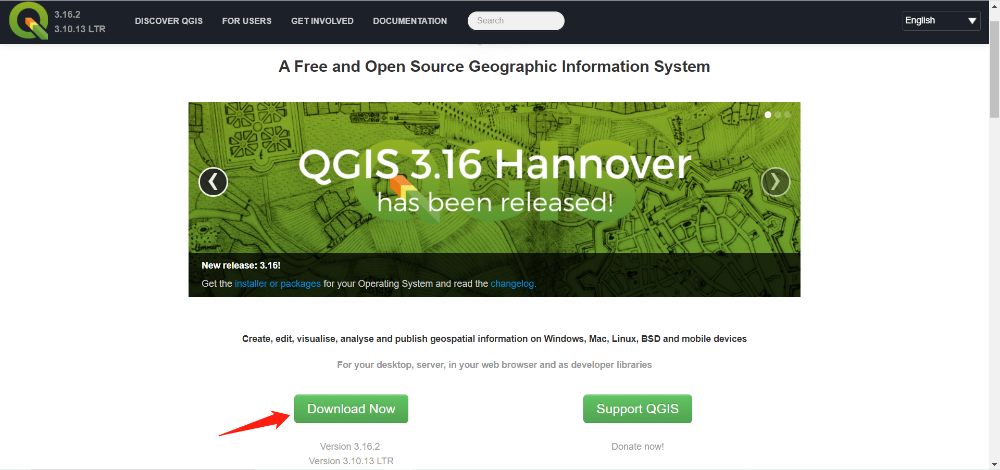
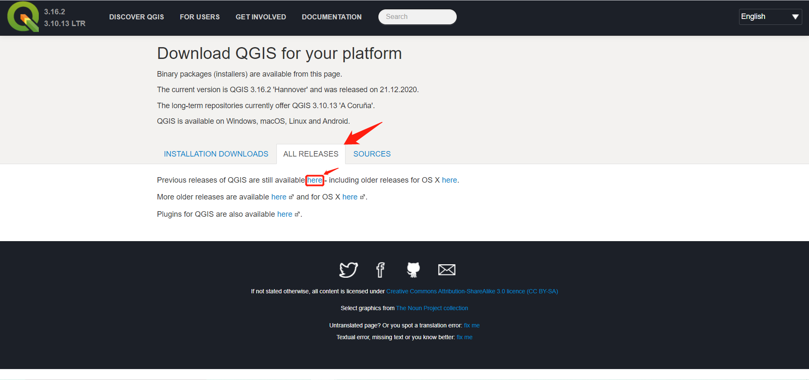
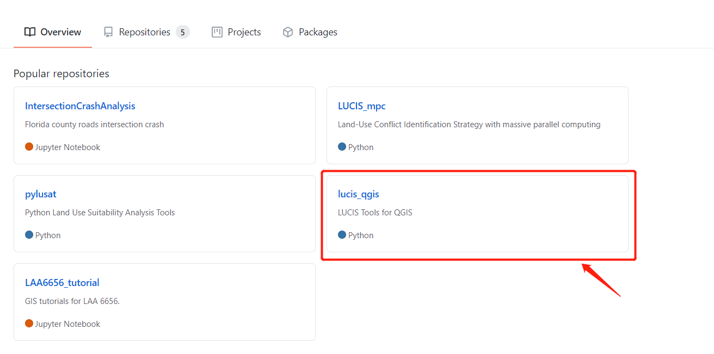
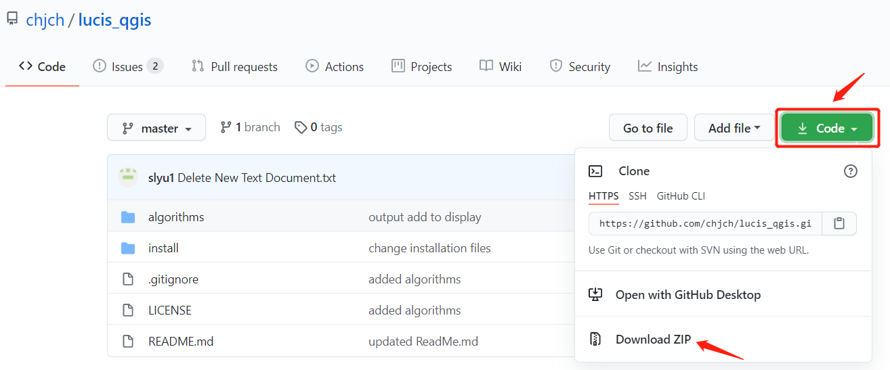
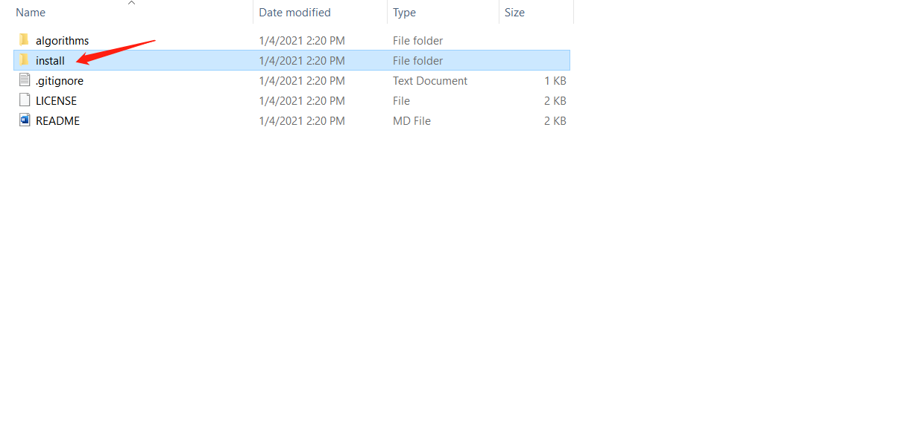
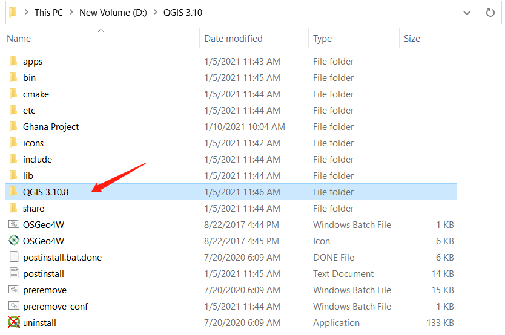
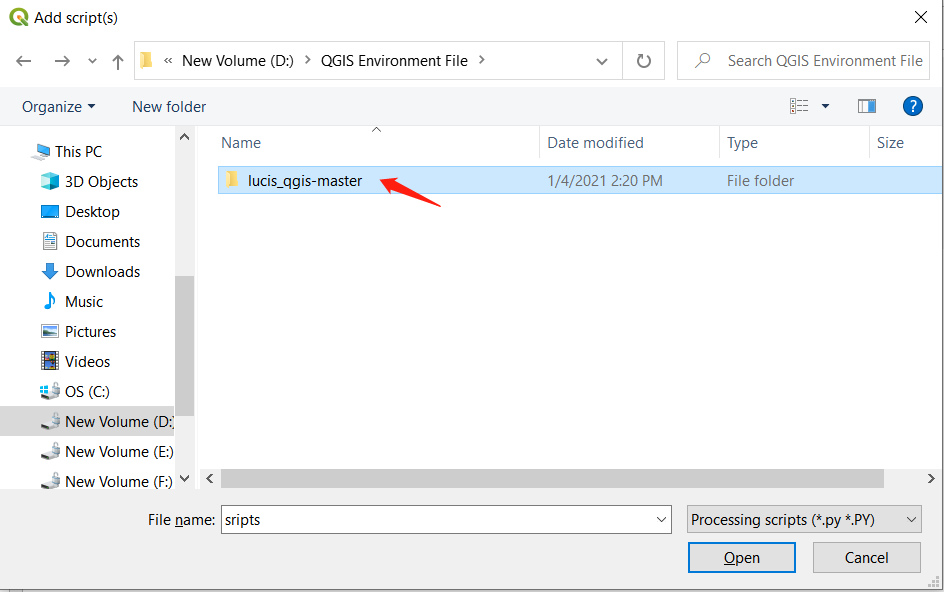
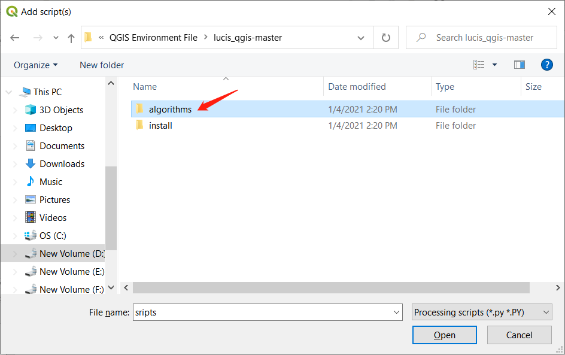

# Tutorial 1 - Software Setup

## Install QGIS

1. **Step 1 - Download**: 

* Go to the [https://qgis.org/en/site/](https://qgis.org/en/site/) and follow the instruction below to download the right version of *QGIS (3.8.10)*.

* Go to the [https://github.com/chjch](https://github.com/chjch) and follow the instruction below to download **_lucis_qgis_** folder.

1. **Step 2 - Install**: 

* Double-click the *QGIS (3.8.10)* installation file you just downloaded from last step, follow the instructions to install the application on your computer.

* Unzip the *lucis_qgis* file (the file name is **lucis_qgis-master**) you just download from last step.
  * Open the *install* folder and the copy the *QGIS 3.10.8* folder to the root folder of the *QGIS (3.8.10)* (**here is the QGIS 3.10**).

  * Open the *QGIS 3.10.8* folder we just added and double click the *install_pylusat* file.

  * Specify the root folder of **QGIS 3.10** for the first question and type *Y*
for the second question.

  * Press Enter key and wait the installation to be completed.

1. **Step 3 - Open the software**: 

* Open the QGIS 3.10 folder on the desktop and double click the *QGIS Desktop 3.10.8* file. 

* Click the python icon in the *Processing Toolbox* and click *add script to tool box*.

  * Find the the *lucis_qgis* folder we download in the first step and open the *algorithm* folder.

  * Add all files into the QGIS. And you can find all the tools in the *Scripts* branch in the *Processing Toolbox*.

